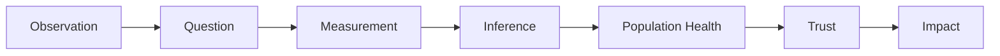

# Introduction

## Why This Guide Exists

Most trainees encounter research as a collection of disconnected skills.

One lecture focuses on study design.

Another introduces statistical tests.

A journal club emphasizes critical appraisal.

A mentor demonstrates how to analyze a dataset.

An online module explains research ethics.

Each component is useful.

Yet many trainees finish their early research experiences with the same feeling:

They have learned techniques without fully understanding how investigators think.

This guide was written to connect those pieces.

Rather than functioning as a traditional epidemiology textbook, the PERT Field Guide focuses on the questions researchers repeatedly ask throughout the lifecycle of a project.

- How do observations become research questions?
- How do we define what we are studying?
- When should we believe an association?
- Why do health outcomes differ across populations?
- Why does society trust researchers?
- How does research create impact?

These questions appear repeatedly regardless of whether a researcher studies depression, Alzheimer's disease, cardiovascular disease, public health policy, neurodevelopment, or healthcare systems.

The methods may change.

The questions remain surprisingly similar.

---

## Why Epidemiology Matters

At its core, epidemiology is the science of explaining patterns.

Why do some individuals develop disease while others do not?

Why do health outcomes differ across populations?

Why do some interventions succeed in one setting but fail in another?

Why do certain risk factors repeatedly appear across studies?

Epidemiology provides a framework for evaluating possible explanations.

Contrary to popular perception, epidemiology is not simply the study of outbreaks or infectious diseases.

Epidemiology is fundamentally about understanding how health and illness are distributed and identifying the factors that influence those patterns.

Many of the most important advances in modern medicine emerged from epidemiologic thinking.

Researchers identified links between smoking and lung cancer.

Public health investigators recognized the importance of clean water systems.

Large population studies clarified risk factors for cardiovascular disease.

These discoveries changed clinical practice long before their biological mechanisms were completely understood.

The ability to identify meaningful patterns remains one of the most powerful tools in medicine.

---

## Why Psychiatry Needs Epidemiology

Psychiatry presents unique challenges for researchers.

Many psychiatric conditions lack definitive laboratory tests.

Symptoms may fluctuate over time.

Diagnoses are often based on clinical assessment rather than a single biological marker.

Outcomes are influenced by genetics, neurobiology, psychology, family environments, social relationships, healthcare systems, and public policy.

As a result, psychiatric questions frequently extend beyond the level of individual patients.

Why are depression rates increasing among certain populations?

Why do mental health outcomes differ across communities?

Why do some individuals recover while others remain symptomatic despite similar treatments?

Why do social factors influence psychiatric outcomes so strongly?

These are epidemiologic questions.

Understanding mental health requires understanding populations.

Psychiatric epidemiology provides tools for studying those patterns and evaluating competing explanations.

For this reason, epidemiology has become increasingly important within modern psychiatry.

---

## The Rise of Population-Scale Data

For much of medical history, investigators relied on relatively small studies.

Today, researchers have access to resources that previous generations could scarcely imagine.

Electronic health records.

National registries.

Biobanks.

Claims databases.

Wearable devices.

Large-scale surveys.

These resources create extraordinary opportunities.

Researchers can study hundreds of thousands—or even millions—of individuals simultaneously.

Rare conditions become easier to investigate.

Long-term outcomes become easier to observe.

Patterns that would once have remained hidden can now be detected.

At the same time, larger datasets do not eliminate the need for careful thinking.

In some ways, they make thoughtful interpretation even more important.

Large datasets can generate countless associations.

The difficult question remains:

Which explanations should we believe?

This guide focuses on that challenge.

---

## How the Chapters Fit Together

The chapters that follow are organized around a sequence of questions investigators repeatedly encounter.

Each chapter builds upon the previous one.

### Chapter 1: Asking Better Questions

Research begins with observation and curiosity.

The first chapter focuses on how investigators identify meaningful questions and transform observations into research programs.

### Chapter 2: Defining What You Are Studying

Before a question can be answered, it must be measured.

This chapter examines how researchers transform concepts into variables.

### Chapter 3: Should You Believe the Result?

Finding an association is only the beginning.

This chapter explores confounding, bias, reverse causation, and causal reasoning.

### Chapter 4: Thinking Like a Population Health Researcher

Health outcomes emerge within larger systems.

This chapter expands the lens from individuals to populations.

### Chapter 5: Research, Responsibility, and Trust

Research depends on trust.

This chapter explores the responsibilities that accompany scientific inquiry.

### Chapter 6: From Question to Impact

Research matters because it contributes to a larger conversation.

The final chapter examines how findings become knowledge, practice, policy, and impact.

---

## How to Use This Guide

This handbook was designed to be read sequentially.

The chapters build upon one another.

However, they can also serve as stand-alone references.

You do not need advanced statistical training to benefit from the material.

Whenever possible, technical language is minimized and concepts are introduced through examples rather than formal definitions.

The goal is not to teach everything.

No single handbook can do that.

The goal is to help readers develop habits of thought that will remain useful long after specific methods, software packages, and datasets have changed.

---

## A Different Way of Thinking

Many scientific disciplines emphasize answers.

Research often begins with questions.

The most successful investigators are not necessarily those who memorize the most facts or master the most software.

They are often those who remain curious longer than everyone else.

They notice patterns.

They identify uncertainty.

They ask difficult questions.

They become uncomfortable with incomplete explanations.

The chapters that follow are ultimately about developing that mindset.

The first chapter begins with the foundation of every research project:

A question.
