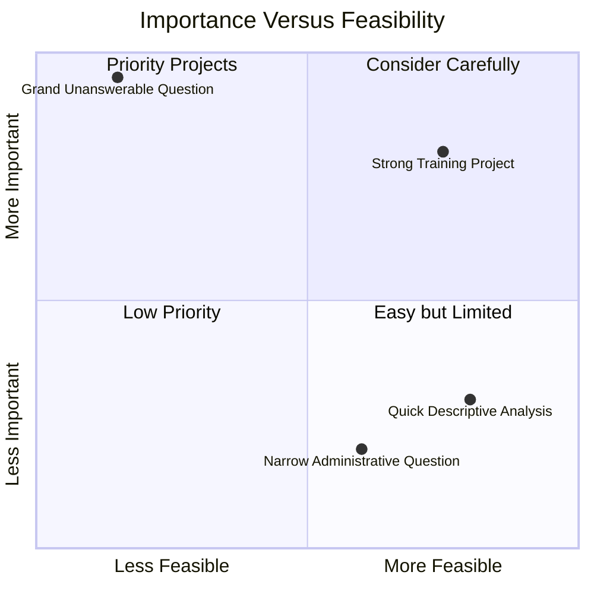
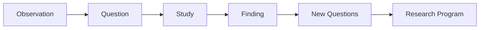

# Chapter 1: Asking Better Questions

> *"The quality of a study is often limited by the quality of the question that motivated it."*

## Why This Matters

Many new investigators assume that research begins with data. A dataset appears, variables are selected, analyses are performed, and eventually a result emerges. From the outside, that sequence seems logical enough. Most published papers present research in exactly that order, beginning with methods and ending with conclusions.

In reality, research begins much earlier.

Long before an investigator opens a dataset, chooses a statistical test, or drafts a manuscript, something else has already happened. An observation has captured someone's attention. A pattern has been noticed. An explanation feels incomplete. A question begins to form.

The quality of that question often determines the trajectory of everything that follows. A well-framed question creates direction. It influences study design, measurement decisions, analytical approaches, interpretation, and future projects. A poorly framed question can generate months of work while producing findings that are difficult to interpret or impossible to build upon.

For this reason, learning to ask better questions is one of the most important skills a researcher can develop. Research careers are rarely built on technical expertise alone. They are built on the ability to identify questions that matter and pursue them thoughtfully over time.

## Research Begins With Observation

Most research questions begin with observations rather than hypotheses.

Sometimes those observations emerge from clinical practice. A psychiatrist notices that many patients with depression also struggle with sleep. A neurologist becomes curious about why two patients with seemingly similar diagnoses experience very different outcomes. A primary care physician notices that certain health problems appear repeatedly within specific communities.

In other cases, observations emerge from reading the literature. Two studies appear to disagree. An established explanation no longer feels sufficient. A limitation appears repeatedly across multiple papers. Occasionally, an observation emerges from a conversation, a historical event, or an unexpected result that simply refuses to make sense.

What all of these situations have in common is uncertainty.

Consider the observation that individuals with chronic sleep disturbance often appear to be at greater risk for depression. Most people would accept that statement and move on. An investigator tends to react differently. Rather than accepting the observation as a fact, they become interested in the unanswered questions surrounding it.

Does sleep disturbance increase depression risk, or does depression disrupt sleep? Do both arise from shared biological mechanisms? Are some populations more vulnerable than others? Could improving sleep reduce future depression risk? Does the relationship vary across the lifespan? How might trauma, socioeconomic conditions, or healthcare access influence the association?

The original observation remains unchanged. What changes is the willingness to interrogate it.

One of the most underrated research skills is learning to notice uncertainty where other people see conclusions.

## Learning to Notice

Experienced investigators often appear to generate project ideas effortlessly. Trainees sometimes assume that successful researchers possess a special form of creativity or intuition that allows them to see opportunities invisible to everyone else.

In reality, most have simply developed the habit of paying attention.

They notice recurring limitations in the literature. They notice assumptions that are treated as settled facts despite limited evidence. They notice patterns that appear repeatedly but remain poorly explained. They notice inconsistencies that other readers skim past.

This habit of observation is more important than many people realize because good research ideas rarely arrive fully formed. They typically emerge gradually as investigators encounter the same unanswered question repeatedly in different contexts.

A clinician may spend months noticing that sleep complaints appear in patient after patient before eventually deciding to investigate the pattern systematically. A researcher reading the literature may encounter the same limitation across multiple papers before recognizing that the limitation itself represents an important opportunity for future work.

In both situations, the critical skill is not intelligence. It is attention.

Many people encounter unanswered questions every day. Investigators are simply more likely to stop and examine them.

## From Observation to Question

The transition from observation to research question is one of the most important steps in the entire research process.

Consider again the observation that sleep disturbance appears to be associated with depression. At first glance, this seems like a question. In reality, it is still a broad area of uncertainty rather than a specific research question.

Different investigators might approach the same observation in very different ways.

A clinician could ask whether treating insomnia improves depressive symptoms. An epidemiologist might ask whether sleep disturbance predicts future depression risk. A neuroscientist could become interested in the biological mechanisms connecting sleep regulation and mood. A population health researcher might focus on why sleep-related mental health disparities appear more common in certain communities than others.

None of these questions is inherently superior. They simply reflect different goals, perspectives, and levels of analysis.

This is an important lesson for new investigators because many spend enormous amounts of time searching for the perfect question. The reality is that most interesting observations can generate dozens of worthwhile questions. The challenge is rarely finding a question. The challenge is deciding which question should be pursued next.

## What Makes a Question Worth Pursuing?

Not every interesting question becomes a good research question.

Consider the question:

> Why are some people happier than others?

It is an interesting question. It is also so broad that it is difficult to study in any meaningful way. Different people would define happiness differently, measure it differently, and propose entirely different explanations for why it varies across individuals.

A more focused version might ask whether perceived social support is associated with depressive symptoms among first-year medical students. The revised question is narrower, but it is also clearer. The population is defined, the concepts are measurable, and the uncertainty can realistically be investigated.

This illustrates an important principle: the goal is not to make questions smaller. The goal is to make them answerable.

Experienced investigators are rarely limited by ideas. More often, they are limited by time, resources, funding, data availability, and attention. Most researchers accumulate far more interesting questions than they can ever hope to pursue. As a result, they spend considerable time deciding which questions deserve investment.

Several considerations tend to matter simultaneously.

First, the question should be important. If the study succeeds, who benefits? Will the answer improve understanding, influence clinical practice, inform policy, or guide future research? Importance does not require immediate practical application, but it does require a reason to care about the answer.

Second, the question should be feasible. A brilliant question that cannot realistically be answered is not especially useful as a training project. Strong projects often emerge when important questions are scaled appropriately for the available time, expertise, and resources.

Finally, good questions tend to generate additional questions. Some studies provide answers and effectively end a line of inquiry. Others open entirely new avenues of investigation. The latter are often the questions that shape careers.

## Importance Versus Feasibility

One way to think about research questions is to imagine them existing along two dimensions: importance and feasibility.

Some questions are highly feasible but relatively unimportant. A dataset may already exist, the variables may be easy to define, and the analysis may be straightforward. Yet the answer contributes little to scientific understanding or practical decision-making. These projects are often completed quickly but rarely leave a lasting impact.

At the opposite extreme are questions that are extraordinarily important but difficult to answer. Questions about the causes of psychiatric illness, the long-term effects of childhood adversity, or the social determinants of health may require decades of work, large datasets, multidisciplinary teams, and repeated investigation across different populations.

Most successful projects occupy the space between these extremes. They ask questions that matter while remaining realistic about the resources available. Particularly early in training, it is often better to contribute a small but meaningful piece of evidence to an important question than to pursue a grand idea that cannot be completed.

This distinction is especially important for students and residents. New investigators sometimes believe they need a revolutionary project to make a meaningful contribution. In reality, many influential research programs were built from a series of modest studies, each addressing a specific aspect of a larger question.

The challenge is not finding the biggest possible question. The challenge is identifying a question that is both important and answerable.



*Figure 1.1. Strong projects often emerge where importance and feasibility overlap. The most compelling research questions matter scientifically while remaining realistic given available time, expertise, and resources.*

## Thinking Beyond Individual Projects

One of the most important transitions in becoming an investigator occurs when you stop thinking exclusively about projects and start thinking about questions.

Students are naturally trained to focus on individual projects. Projects have clear beginnings and endings. They lead to posters, presentations, manuscripts, and completed assignments. They fit neatly into academic calendars and training programs.

Scientific progress rarely works that way.

Most influential investigators are not remembered because they completed a particular project. They are remembered because they spent years—or sometimes entire careers—trying to answer a small number of important questions. Individual studies served as milestones along the way, but the questions themselves provided the long-term direction.

This distinction may seem subtle, but it changes how research is approached.

A project asks:

> What can I finish this year?

A research program asks:

> What am I trying to understand over the next decade?

The answer does not need to be precise. In fact, it usually evolves over time. What matters is developing the habit of seeing projects as pieces of a larger intellectual journey rather than isolated academic tasks.

## The ACE Study as a Research Program

The Adverse Childhood Experiences (ACE) Study provides a useful example.

The original investigators were not attempting to create an entirely new field of research. They began with observations suggesting that adverse experiences during childhood might have long-term consequences extending far beyond childhood itself. The initial study explored whether abuse, neglect, and household dysfunction were associated with adult health outcomes decades later.

Had the project ended there, it would still have been influential.

Instead, it generated an entirely new set of questions.

Researchers began investigating how childhood adversity influences mental health, substance use, cardiovascular disease, educational outcomes, resilience, social functioning, healthcare utilization, and lifespan health trajectories. New studies explored biological mechanisms, prevention strategies, public health interventions, and policy implications.

More than two decades later, investigators are still pursuing questions that emerged from the original observation.

This is how many research programs develop. A study produces findings, but more importantly, it produces new uncertainty. Those new uncertainties become the foundation for future work.

The most productive questions often behave this way. They generate answers, but they also generate additional questions worth pursuing.

## Reading the Literature Like an Investigator

Many trainees approach scientific papers primarily as sources of information. They read a paper to learn what the investigators found and then move on to the next article.

Experienced investigators often read differently.

Of course they care about the findings, but they are equally interested in what remains unresolved. They pay attention to limitations, inconsistencies, unanswered questions, and opportunities for future work. Sometimes the most valuable part of a paper is not the conclusion but the uncertainty that remains after the conclusion.

Imagine reading a study demonstrating an association between sleep disturbance and depression. A student may focus primarily on the result itself. An investigator is more likely to ask additional questions.

How was sleep measured?

Would the findings be similar in adolescents?

What about older adults?

Could healthcare utilization influence the association?

How might socioeconomic conditions affect the relationship?

Could an intervention study address causality more directly?

The paper becomes more than a source of information. It becomes a source of questions.

Over time, this habit fundamentally changes how the literature feels. Instead of a collection of completed studies, it becomes a map of what is known, what remains uncertain, and where future discoveries may emerge.

Some of the best research ideas come not from entirely new observations but from reading existing studies carefully enough to recognize what still needs to be understood.



*Figure 1.2. Most research careers begin with a simple observation. Individual studies provide answers, but they also generate new questions. Over time, those questions can evolve into a broader research program.*

## Reading Assignment

### Foundational Reading

**Felitti VJ, Anda RF, Nordenberg D, Williamson DF, Spitz AM, Edwards V, Koss MP, Marks JS. (1998).** *Relationship of Childhood Abuse and Household Dysfunction to Many of the Leading Causes of Death in Adults: The Adverse Childhood Experiences (ACE) Study.*

📄 **Read the paper:** [Felitti et al. (1998) ACE Study](../papers/Felitti_1998_ACE_Study.pdf)

As you read, focus less on the specific statistical methods and more on the evolution of the research question itself. The ACE Study provides a remarkable example of how an observation can grow into a research program. What began as an effort to understand the long-term consequences of childhood adversity ultimately transformed how researchers think about mental health, chronic disease, prevention, resilience, and population health.

Pay particular attention to the following questions:

* What observations appear to have motivated the study?
* Why was the question important enough to pursue?
* How did the investigators transform a broad idea into a measurable research question?
* What new questions emerged from the findings?
* How did the project ultimately grow into an enduring research program?

## Building Your Project

By the end of this chapter, you should begin developing a question that you can refine throughout the remainder of the handbook. At this stage, resist the temptation to make the question perfect. The goal is not to identify a final project but to begin practicing the process of moving from observation to investigation.

Start by writing down three observations that genuinely interest you. These observations may come from clinical experiences, coursework, conversations, personal interests, public health concerns, or patterns you have noticed while reading the scientific literature.

For each observation, spend a few minutes exploring what remains uncertain. What do you find yourself wondering about? What explanations seem plausible? What information feels incomplete? The objective is not to generate hypotheses immediately but to become more comfortable identifying unanswered questions.

Next, select one observation and develop two or three possible research questions. Notice how different questions can emerge from the same observation depending on the population, outcome, timeframe, or level of analysis being considered.

Finally, reflect on which question you find yourself returning to most naturally. If given six months to explore one of these ideas, which would continue to hold your attention? Which feels important enough to justify the effort required to answer it?

You do not need a complete study design yet. In fact, most questions will change substantially as you move through the next several chapters. What matters is identifying a question that sparks genuine curiosity.

That curiosity will be far more valuable than methodological perfection at this stage.

## Investigator's Notebook

Throughout this handbook, you will encounter periodic notebook prompts. These exercises are not intended to test memorization. Instead, they are designed to help you think like an investigator and gradually develop your own research ideas.

For this chapter, consider the following questions:

### Reflection 1

Think about a recent clinical experience, news article, scientific paper, or personal observation that captured your attention.

What specifically made it interesting?

Was it surprising? Confusing? Concerning? Did it challenge an assumption you previously held?

Try to identify the uncertainty that made the observation memorable.

### Reflection 2

Consider a question that has repeatedly captured your attention over the past year.

Why does this question continue to matter to you?

Does it connect to a broader issue in medicine, psychiatry, neuroscience, public health, or society? Could it generate multiple studies rather than a single project?

Many enduring research programs begin with questions that investigators simply cannot stop thinking about.

### Reflection 3

Review the ACE Study after completing the reading assignment.

Can you identify the sequence from observation to research program?

What additional questions would you pursue if you were continuing that line of research today?

## Questions Worth Carrying Forward

As you move into the next chapter, remember that research questions do not emerge fully formed. They are refined through repeated cycles of observation, discussion, reading, critique, and revision. The strongest investigators are rarely those who generate perfect questions immediately. More often, they are the people who remain curious long enough to improve their questions over time.

This distinction matters because the remainder of the handbook will build upon the question you begin developing here. Before you can evaluate evidence, you must decide what you are trying to understand. Before you can interpret a result, you must determine what is being measured. Before you can influence practice, policy, or population health, you must identify a question worth pursuing.

The process starts with observation.

It continues through measurement, inference, and interpretation.

But none of it happens without a question.

The next chapter explores what may be the most overlooked challenge in research: deciding what, exactly, we are measuring when we believe we are studying something.

```
```

