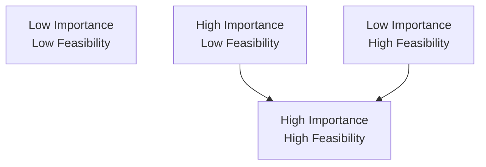
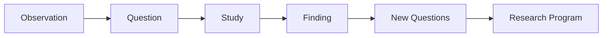

# Chapter 1: Asking Better Questions

> *"The quality of a study is often limited by the quality of the question that motivated it."*

## Why This Matters

Most new investigators assume that research begins with data.

A dataset appears. Variables are selected. Analyses are performed. Results emerge.

In reality, research begins much earlier.

It begins with a question.

Datasets are abundant. Statistical methods are abundant. Software is abundant. Meaningful questions are comparatively rare. Many projects struggle not because the analyses are incorrect, but because the question itself was never clearly defined. A poorly framed question can generate months of work and still produce results that are difficult to interpret or impossible to build upon.

A strong question creates direction. It influences study design, measurement decisions, statistical analysis, interpretation, and future projects. Long before an investigator opens a dataset, the trajectory of a study is often being shaped by the question that inspired it.

For this reason, learning to ask better questions is one of the most important skills a researcher can develop.

Research careers are rarely built on technical skills alone.

They are built on questions.

---

## Research Begins With Observation

Every research question starts with an observation.

Sometimes the observation comes from clinical practice. Sometimes it comes from reading the literature. Sometimes it emerges from a conversation, a historical event, a surprising result, or simple curiosity.

The observation itself is not yet a research question.

For example:

- Patients with depression often report poor sleep.
- Individuals exposed to childhood adversity appear to experience higher rates of psychiatric illness.
- Certain communities experience worse health outcomes despite similar healthcare access.
- Some patients improve dramatically after treatment while others experience little benefit.

These observations are interesting, but they do not yet tell us what should be studied.

A research question emerges when an investigator identifies uncertainty.

The investigator begins asking:

> What do we not yet understand?

Research begins where certainty ends.

---

## Learning to Notice

One of the most underrated research skills is learning to notice.

Experienced investigators often appear to generate project ideas effortlessly. In reality, many have simply trained themselves to pay attention to unanswered questions, inconsistencies, assumptions, and recurring patterns.

Most people encounter uncertainty and move on.

Investigators pause.

A clinician notices that many patients with depression also struggle with sleep. Most people accept the observation and continue with their day. An investigator starts asking additional questions.

Why does this occur?

Did sleep problems come first?

Does depression disrupt sleep?

Do both arise from shared risk factors?

Could improving sleep reduce depression risk?

Could the relationship differ across populations?

A project begins the moment someone becomes unwilling to accept an incomplete explanation.

The habit of pausing long enough to ask "Why?" is often the beginning of a research career.

---

## Curiosity Is a Skill

Curiosity is often described as a personality trait.

In practice, it behaves more like a skill.

Like any skill, it can be strengthened through deliberate practice.

Consider a simple observation:

> Sleep disturbance is associated with depression.

One response is to memorize the fact.

Another is to generate questions.

- Does sleep disturbance precede depression?
- Does depression cause sleep disturbance?
- Do they share biological mechanisms?
- Does treating sleep disturbance reduce depression risk?
- Are some populations more vulnerable than others?
- Does age matter?
- Does trauma matter?
- Does healthcare access influence detection?

A single observation can generate dozens of meaningful questions.

Strong investigators do not necessarily begin with better ideas.

They often begin by asking more questions.

---

## From Observation to Question: A Worked Example

Consider the observation that patients with depression frequently report poor sleep.

A trainee encountering this pattern might initially ask:

> What is the relationship between sleep and depression?

This is a reasonable starting point, but it remains broad.

With further refinement, the question can evolve in several directions.

A clinician might ask:

> Does treating insomnia improve depressive symptoms?

An epidemiologist might ask:

> Does sleep disturbance predict future depression risk?

A neuroscientist might ask:

> Which biological mechanisms connect sleep regulation and mood?

A population health researcher might ask:

> Why are sleep-related mental health disparities more common in certain communities?

Notice that the same observation generated multiple research questions. None is inherently superior. They simply reflect different scientific goals.

This is an important lesson.

The challenge is rarely finding a question.

The challenge is identifying which question is most useful to pursue next.

---

## The Difference Between Interesting and Researchable

Not every interesting question becomes a good research question.

Consider:

> Why are some people happier than others?

This is an interesting question.

It is also extraordinarily broad.

A more researchable version might be:

> Is perceived social support associated with depressive symptoms among first-year medical students?

The second question identifies:

- A population
- A measurable exposure
- A measurable outcome

Most importantly, it can be studied.

Research questions become stronger as uncertainty becomes more focused.

The goal is not to make questions smaller.

The goal is to make them answerable.

---

## What Makes a Good Research Question?

Good research questions share several characteristics.

They address meaningful uncertainty. They matter to patients, populations, clinicians, or scientific understanding. They are specific enough to study and feasible enough to complete.

Importantly, a question does not need to be completely novel to be valuable.

Many new investigators become preoccupied with finding a question nobody has ever asked before. Novelty has value, but importance usually matters more.

A carefully executed study addressing an important question often contributes more than a highly original study addressing a trivial one.

A useful question to ask is:

> If I successfully answer this question, who benefits?

The answer often reveals whether a project is worth pursuing.

---

## Importance Versus Feasibility

One useful way to evaluate potential projects is to consider both importance and feasibility.

A question may be scientifically important but impossible to answer with available resources. Another may be easy to study but contribute little knowledge.

The ideal training project sits at the intersection of both.

When evaluating a potential project, ask:

- Does this question matter?
- Can I realistically answer it?

Strong projects often emerge when important questions are scaled appropriately for available time, resources, and expertise.

---

## A Project Is Not a Research Program

One of the most important transitions in research training involves learning the difference between projects and questions.

New investigators often think in terms of projects.

Experienced investigators often think in terms of enduring questions.

A project may last months.

A question may last years.

Sometimes decades.

Consider an investigator interested in sleep and depression.

The first project examines their association.

A second explores temporal relationships.

A third investigates biological mechanisms.

A fourth evaluates interventions.

A fifth studies population-level differences.

The projects differ.

The underlying question remains.

Strong research careers are often built around enduring questions rather than isolated studies.

Projects come and go.

Questions endure.

---

## Building a Research Program

Research programs often develop gradually rather than intentionally.

Consider the following progression.

### Observation

Patients with depression frequently report poor sleep.

### Question

What is the relationship between sleep disturbance and depression?

### Study

Conduct an observational study examining sleep and depression.

### Finding

Sleep disturbance predicts future depression risk.

### New Questions

- Why?
- Through what mechanisms?
- Can intervention alter the relationship?
- Are certain populations more vulnerable?
- Do healthcare systems influence detection?

### Research Program

A sustained effort to understand how sleep influences mental health.

This progression illustrates an important principle.

A good study often answers one question while generating several new ones.

That is not failure.

That is science.

---

## Reading the Literature Differently

Many trainees read scientific papers primarily to learn what is known.

Experienced investigators often read papers to discover what remains unknown.

When reading a manuscript, ask:

- Why was this study performed?
- What uncertainty motivated it?
- What assumptions were made?
- What limitations remain?
- What questions remain unanswered?
- What should happen next?

This approach transforms reading from passive consumption into active idea generation.

Every paper becomes a potential source of future projects.

---

## Where Good Ideas Come From

Many trainees assume that good ideas arrive suddenly.

In reality, they usually emerge gradually.

The same limitation appears repeatedly in the literature.

The same clinical pattern appears in multiple settings.

The same inconsistency appears across studies.

Eventually, a pattern becomes impossible to ignore.

The investigator begins asking questions.

Many research ideas originate not from moments of inspiration but from sustained attention.

This is encouraging because it means creativity is not mysterious.

It often begins with observation.

---

## Figure: From Observation to Research Program

The goal of a project is not simply to produce a result.

The goal is to generate better questions.

---

## Reading Assignment

**Classic Reading:**

[Placeholder for future reading assignment]

**Modern Applied Example:**

[Placeholder for future reading assignment]

---

## Building Your Project

### Step 1

Identify an observation that captures your attention.

### Step 2

Describe the uncertainty surrounding that observation.

### Step 3

Generate at least five possible research questions.

### Step 4

Evaluate importance.

### Step 5

Evaluate feasibility.

### Step 6

Refine the question.

### Step 7

Identify what new questions might emerge if the study succeeds.

---

## Investigator's Notebook

Answer the following:

- What observation consistently captures my attention?
- What uncertainty do I most want to understand?
- Why does this question matter?
- Is the question answerable?
- Who benefits if it is answered?
- Could this question support multiple future projects?

---

## Questions Worth Carrying Forward

1. What observation am I trying to explain?
2. What uncertainty motivates this project?
3. Why does this question matter?
4. Is the question answerable?
5. What question should come next?

The next chapter explores what happens after a question has been chosen.

Once investigators decide what they want to understand, they face a new challenge:

> How do we define exactly what we are trying to measure?
