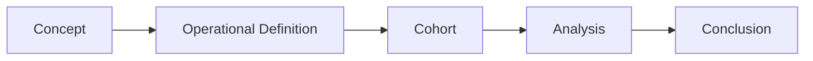

# Chapter 2: Defining What You Are Studying

> *"Before a question can be answered, it must first be measured."*

## Why This Matters

The transition from an interesting idea to a research project occurs when a concept becomes a variable.

This sounds straightforward.

In practice, it is one of the most difficult and important steps in the research process.

Researchers routinely study concepts such as depression, resilience, trauma, recovery, cognitive decline, quality of life, social support, and stress. These ideas feel intuitive because we encounter them regularly in clinical practice and everyday life.

The moment we attempt to study them scientifically, however, a problem emerges.

How exactly should they be measured?

Different investigators often answer that question differently.

As a result, studies that appear to examine the same topic may actually be studying different phenomena altogether.

The purpose of this chapter is to understand how investigators translate ideas into measurable variables and why those decisions matter.

---

## Concepts and Constructs

Many of the things researchers care about cannot be observed directly.

Depression cannot be seen.

Anxiety cannot be weighed.

Resilience cannot be measured with a ruler.

These are examples of constructs.

A construct is an underlying concept that investigators attempt to measure indirectly.

Consider depression.

Possible measurements include:

- Diagnostic codes
- Structured clinical interviews
- Symptom scales
- Medication prescriptions
- Clinical notes
- Self-reported diagnoses

Each approach captures something slightly different.

None of them are identical to depression itself.

This distinction is important because variables are not reality.

They are representations of reality.

One of the most important habits in research is remembering that distinction.

---

## The Map Is Not the Territory

Imagine looking at a map of a city.

The map contains useful information. Roads, landmarks, boundaries, and distances are represented in ways that help people navigate.

However, the map is not the city.

It is a simplified representation.

Research variables function similarly.

A diagnosis code is not depression.

A laboratory value is not health.

A survey response is not quality of life.

These measurements provide useful representations of underlying concepts.

Problems arise when investigators forget this distinction and begin treating variables as though they perfectly capture reality.

Thoughtful researchers remain aware of the gap between a concept and its measurement.

---

## Operationalization

Operationalization is the process of transforming a concept into something measurable.

Researchers sometimes underestimate how important this step is.

In reality, operationalization determines what a study actually becomes.

Suppose an investigator wishes to study sleep disturbance.

Several options are available:

- Insomnia diagnosis
- Sleep medication prescriptions
- Self-reported sleep duration
- Wearable device measurements
- Polysomnography metrics

Each definition identifies a different population.

Each captures a different aspect of sleep.

Each may generate different findings.

Operationalization is therefore not merely a technical decision.

It is a scientific decision.

The question is not:

> How can I measure this concept?

The more important question is:

> Which measurement best aligns with the question I am trying to answer?

---

## A Worked Example: Four Definitions of Depression

Imagine four investigators studying depression.

All four claim to be studying the same condition.

In reality, they may be studying different populations.

| Definition | What It Captures | What It May Miss |
|------------|------------------|------------------|
| Diagnostic code | Clinically recognized depression | Undiagnosed cases |
| PHQ-9 score | Current symptom burden | Individuals not surveyed |
| Antidepressant prescription | Treated depression | Untreated depression |
| Structured interview | Carefully assessed depression | Individuals outside research settings |

Now imagine each investigator studies the relationship between depression and sleep disturbance.

The resulting cohorts differ.

The prevalence differs.

The associations may differ.

The conclusions may differ.

The scientific question appears identical.

The measurement decisions are not.

This example illustrates a central lesson of epidemiology:

> Before asking whether a finding is correct, ask what was actually measured.

---

## One Concept, Many Definitions

Depression is not unique.

Most constructs can be defined in multiple ways.

An investigator studying cognitive decline might use:

- Clinical diagnosis
- Cognitive testing
- Informant reports
- Functional impairment measures

An investigator studying trauma might use:

- Adverse childhood experience scores
- Self-reported traumatic events
- Clinical documentation
- Administrative records

Different definitions produce different cohorts.

Different cohorts may produce different findings.

This reality explains why apparently contradictory studies sometimes coexist in the literature.

Researchers may not be studying exactly the same thing.

---

## Reliability

A measurement should be consistent.

Reliability refers to the extent to which a measure produces stable results.

Imagine stepping onto a scale five times in one minute.

If the scale reports dramatically different values each time, it is unreliable.

Research variables can suffer from similar problems.

Examples include:

- Inconsistent charting practices
- Variable survey responses
- Observer disagreement
- Data entry errors
- Device malfunctions

Unreliable measures create noise.

Noise makes meaningful patterns harder to detect.

Reliability does not guarantee accuracy.

However, without reliability, accuracy becomes difficult to evaluate.

---

## Validity

Reliability alone is not enough.

A scale that consistently reports the wrong weight is reliable but invalid.

Validity refers to whether a measure captures what it is intended to measure.

Several forms of validity are commonly discussed.

### Face Validity

Does the measure appear reasonable?

### Construct Validity

Does the measure behave as expected relative to related concepts?

### Criterion Validity

Does the measure correspond with an accepted reference standard?

Although these categories are useful, the central question remains simple:

> Does this variable represent the concept I care about?

---

## Case Definitions

Case definitions are among the most important decisions in epidemiology.

A case definition specifies how individuals are classified as having a condition.

Broad definitions increase sensitivity.

Narrow definitions increase specificity.

Neither approach is automatically correct.

The appropriate choice depends on the research question.

Researchers should therefore justify case definitions rather than treating them as obvious choices.

---

## Continuous and Categorical Variables

Investigators frequently convert complex phenomena into categories.

Examples include:

- Depressed versus not depressed
- Obese versus not obese
- Hypertensive versus normotensive

Categorization simplifies analysis.

However, simplification comes at a cost.

Many phenomena exist on continua.

Blood pressure exists on a spectrum.

Depressive symptoms exist on a spectrum.

Sleep quality exists on a spectrum.

Whenever continuous variables are converted into categories, information is lost.

Sometimes that tradeoff is worthwhile.

Sometimes it is not.

Thoughtful investigators consider what is gained and what is sacrificed.

---

## Measurement Error

Every measurement contains error.

The goal is not to eliminate error entirely.

The goal is to understand it.

Measurement error can arise from:

- Instrument limitations
- Survey design
- Recall bias
- Missing data
- Coding practices
- Data processing decisions

Even small amounts of error can influence findings.

For this reason, experienced investigators often spend substantial time understanding how variables were created before conducting analyses.

---

## Misclassification

Misclassification occurs when individuals are assigned to the wrong category.

Examples include:

- A patient with depression who is not identified as depressed
- A patient without depression who is classified as depressed

Misclassification can influence effect estimates, distort associations, and alter conclusions.

Importantly, misclassification is not always obvious.

A dataset may appear complete while still containing substantial classification error.

The quality of an analysis is ultimately limited by the quality of the measurements that produced it.

---

## Common Data Sources

Modern epidemiology relies upon multiple sources of information.

Each provides opportunities and limitations.

### Electronic Health Records

Rich clinical detail but dependent upon documentation practices and healthcare utilization.

### Claims Data

Large sample sizes but limited clinical granularity.

### Surveys

Direct measurement of participant experiences but vulnerable to reporting biases.

### Registries

Focused disease-specific information but often limited generalizability.

### Biobanks

Powerful integration of clinical and biological data but frequently affected by selection processes.

No dataset is perfect.

The goal is not to find flawless data.

The goal is to understand the strengths and weaknesses of the data being used.

---

## What Am I Really Measuring?

One of the most useful questions an investigator can ask is:

> What am I really measuring?

Consider an EHR-based study of depression.

Are you measuring depression itself?

Or are you measuring:

- Depression that was recognized?
- Depression that was documented?
- Depression that resulted in healthcare utilization?
- Depression that received a diagnostic code?

The answer matters.

Many variables reflect both the underlying phenomenon and the processes through which information enters a dataset.

Recognizing this reality often leads to more careful interpretation.

---

## Figure: From Concept to Conclusion

Many of the most important scientific decisions occur before any analysis begins.

---

## Reading Assignment

**Classic Reading:**

[Placeholder for future reading assignment]

**Modern Applied Example:**

[Placeholder for future reading assignment]

---

## Building Your Project

### Step 1

Identify your primary exposure.

### Step 2

Identify your primary outcome.

### Step 3

List three alternative ways each could be measured.

### Step 4

Evaluate strengths and weaknesses of each approach.

### Step 5

Choose the definition that best aligns with your research question.

### Step 6

Identify assumptions required by those measurements.

---

## Investigator's Notebook

Answer the following:

- What concept am I trying to study?
- How am I measuring it?
- What assumptions does that measurement require?
- What might my variable fail to capture?
- How would another investigator define the same concept differently?
- What am I really measuring?

---

## Questions Worth Carrying Forward

1. What exactly am I measuring?
2. Does my variable represent the concept I care about?
3. What assumptions are embedded in my definitions?
4. How might different definitions change the findings?
5. What information is lost during measurement?

The next chapter asks a question that lies at the heart of epidemiology:

> When should we believe an observed association?
