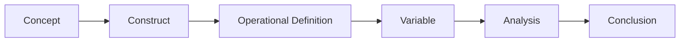

# Chapter 2: Defining What You Are Studying

> *"Before a question can be answered, it must first be measured."*

## Why This Matters

In the previous chapter, we focused on questions. We explored how observations become research questions and how those questions can eventually evolve into larger research programs.

Once a question has been identified, however, investigators encounter a new challenge. In many ways, it is one of the most difficult challenges in all of research.

How do we measure the thing we want to study?

At first glance, this problem may seem straightforward. If we want to study depression, we measure depression. If we want to study trauma, we measure trauma. If we want to study cognitive decline, we measure cognitive decline.

The difficulty is that many of the concepts researchers care about cannot be observed directly.

Depression cannot be placed on a scale and weighed. Resilience cannot be measured with a ruler. Social support cannot be collected in a blood tube and sent to a laboratory. Even concepts that feel familiar in clinical practice often become surprisingly difficult to define once we attempt to study them systematically.

As a result, one of the most important lessons in research is that investigators rarely study concepts directly. Instead, they study measurements that are intended to represent those concepts.

That distinction may sound subtle, but it influences nearly every aspect of scientific inquiry. Two investigators may claim to be studying the same phenomenon while using entirely different definitions, measurements, and assumptions. Their studies may produce different results not because one is correct and the other is wrong, but because they are measuring different aspects of a complex reality.

For this reason, experienced investigators spend considerable time thinking about measurement before they ever begin analyzing data.

Many of the most important scientific decisions occur long before the first statistical test is performed.

## Concepts, Constructs, and Reality

Many of the variables used in research are representations of underlying ideas rather than direct observations.

Researchers often refer to these underlying ideas as constructs.

A construct is a concept that cannot be measured directly but can be studied through observable indicators. Examples include depression, anxiety, resilience, quality of life, stress, cognitive function, and social support. These concepts are real and important, but they do not exist in a form that can be observed as easily as height, weight, or blood pressure.

Consider depression.

If you ask ten clinicians whether depression exists, all ten will almost certainly say yes. If you ask those same clinicians how depression should be measured, however, the answers may begin to diverge.

Some investigators may prefer diagnostic codes recorded in electronic health records. Others may favor structured psychiatric interviews. Some may rely on symptom scales such as the PHQ-9. Others may use antidepressant prescriptions, clinical notes, self-reported diagnoses, or combinations of multiple measures.

Each approach captures something meaningful.

None of them are identical to depression itself.

This distinction is worth emphasizing because it represents one of the most common sources of confusion in research. Variables are often discussed as though they are the concepts they represent. In reality, they are only approximations.

Researchers do not measure depression.

They measure indicators that are intended to reflect depression.

Researchers do not measure resilience.

They measure indicators that are intended to reflect resilience.

Researchers do not measure quality of life.

They measure indicators that are intended to reflect quality of life.

The difference may seem philosophical, but it has practical consequences. Once investigators recognize that variables are representations rather than reality itself, they begin asking different questions. They become more interested in how measurements were created, what assumptions they require, and what aspects of the underlying construct they may fail to capture.

Those questions often matter as much as the results themselves.

## The Map Is Not the Territory

A useful way to think about measurement is through the analogy of a map.

Imagine that you are visiting an unfamiliar city. A map can be extraordinarily helpful. It can show roads, landmarks, boundaries, and distances. It can help you navigate efficiently and avoid getting lost.

At the same time, no one would confuse the map with the city itself.

The map is a simplified representation. Certain details are included, while others are omitted. Different maps emphasize different features depending on their purpose. A tourist map, a transit map, and a topographic map may all describe the same city while presenting very different information.

Research variables function in much the same way.

A diagnosis code is not depression. A survey score is not anxiety. A laboratory value is not health. A wearable device measurement is not sleep quality. These variables are maps rather than territories. They provide useful representations of underlying phenomena, but they are never complete descriptions of reality.

Problems arise when investigators forget this distinction.

Imagine a study that defines depression exclusively through diagnostic codes. The resulting cohort may capture individuals whose depression was recognized, documented, and coded within a healthcare system. It may miss individuals who never sought care, individuals whose symptoms were not documented, or individuals who experienced depression but received a different diagnosis.

The variable still provides useful information. The problem is not the measurement itself. The problem occurs when the measurement is treated as though it perfectly captures the underlying construct.

Thoughtful investigators remain aware of the gap between a concept and its measurement. They recognize that every variable highlights some aspects of reality while obscuring others.

One of the most useful habits in epidemiology is asking a deceptively simple question:

> What does this variable actually represent?

The answer is often more complicated than it first appears.

## Turning Ideas Into Variables

The process of translating a concept into a measurable variable is known as operationalization.

Although the term sounds technical, the underlying idea is straightforward. Operationalization involves deciding how a concept will be represented within a study.

This step is often treated as a methodological detail. In reality, it is one of the most important scientific decisions an investigator makes.

Consider a researcher interested in sleep disturbance. There is no single way to define the concept. One investigator might use insomnia diagnoses recorded in electronic health records. Another might rely on self-reported sleep duration. A third could use data collected from wearable devices. A fourth might focus on polysomnography measurements obtained in a sleep laboratory.

All of these approaches are defensible.

All of them capture different aspects of sleep.

And all of them may produce different findings.

This is why operationalization is not merely a technical exercise. It is a scientific choice that determines what a study ultimately becomes. By deciding how a concept will be measured, investigators simultaneously decide who enters the study, how exposures and outcomes are defined, and what conclusions can reasonably be drawn.

The question is not simply:

> How can I measure this concept?

The more important question is:

> Which measurement best aligns with the question I am trying to answer?

```
```
## A Worked Example: Four Definitions of Depression

Imagine four investigators who all claim to be studying depression.

At first glance, it might seem reasonable to assume that they are studying the same condition. After all, depression is the stated outcome in each study. If the question and outcome are the same, shouldn't the studies be comparable?

Not necessarily.

The challenge is that depression can be defined in many different ways, and each definition captures a somewhat different population.

One investigator identifies depression using ICD-10 diagnostic codes recorded in an electronic health record. Another uses PHQ-9 scores collected through participant surveys. A third defines depression through antidepressant prescriptions. A fourth relies on structured clinical interviews conducted by trained research personnel.

Each approach appears reasonable. Yet each captures something slightly different.

The investigator using diagnostic codes is studying depression that was recognized, documented, and entered into a healthcare system. The investigator using PHQ-9 scores is measuring current symptom burden among participants who completed a survey. The investigator using antidepressant prescriptions may capture treated depression, but will also include individuals taking medications for anxiety, chronic pain, or other conditions. The investigator conducting structured interviews may achieve a highly rigorous assessment but may also be studying a population that differs substantially from the broader community.

None of these approaches is inherently correct or incorrect.

The more important observation is that they are not interchangeable.

A patient could easily meet one definition while failing to meet another. Some individuals with clinically significant depression may never receive a diagnosis code. Others may carry a diagnosis in their medical record despite having minimal current symptoms. Some may receive treatment without ever participating in a research survey. Others may report severe symptoms despite having little interaction with the healthcare system.

As a result, studies that appear to investigate the same question may actually be studying different populations.

This reality explains why apparently contradictory findings sometimes appear in the literature. Researchers may not be disagreeing about the relationship being studied. They may simply be measuring different versions of the same underlying construct.

Before asking whether a finding is correct, it is often worth asking a simpler question:

> What definition was used, and who entered the study because of that definition?

## One Concept, Many Definitions

Depression is not unusual in this regard.

Nearly every construct studied in epidemiology can be defined in multiple ways.

Consider cognitive decline. An investigator might rely on diagnostic codes for dementia, formal neuropsychological testing, informant reports, functional assessments, prescription patterns, or combinations of multiple measures. Each approach captures a different aspect of the phenomenon.

The same is true for trauma. Researchers may use adverse childhood experience scores, self-reported traumatic events, clinical documentation, diagnostic codes, military records, or administrative datasets. Although these approaches all relate to trauma, they do not necessarily identify the same individuals.

Even seemingly straightforward concepts can become complicated when examined closely. Obesity may be defined using body mass index, waist circumference, body fat percentage, imaging measures, or metabolic indicators. Physical activity may be assessed through questionnaires, accelerometers, smartphone data, fitness trackers, or direct observation.

The more researchers work with data, the more they realize that definitions are rarely neutral. Every definition includes certain people while excluding others. Every definition emphasizes certain aspects of a phenomenon while minimizing others.

For this reason, experienced investigators often spend as much time thinking about measurement as they do thinking about analysis.

The most sophisticated statistical model in the world cannot fully compensate for a poorly aligned measurement strategy.

## Reliability: Can You Measure It Consistently?

Before asking whether a variable is measuring the right thing, investigators must first ask whether it measures anything consistently at all.

Reliability refers to the stability and consistency of a measurement.

Imagine stepping onto a scale five times within a few minutes. If the scale reports dramatically different values each time, you would quickly lose confidence in its usefulness. Even if the average value happened to be correct, the inconsistency would make interpretation difficult.

Research measurements face similar challenges.

Survey responses may vary depending on wording, timing, or context. Clinicians may document information differently. Multiple observers may interpret the same situation in different ways. Devices may malfunction. Data may be entered incorrectly. Participants may respond differently when asked the same question at different times.

All of these factors introduce variability that can obscure meaningful patterns.

One way to think about reliability is that it determines how much signal can be distinguished from noise. When reliability is poor, genuine relationships become harder to detect because random variation overwhelms the underlying pattern.

Importantly, reliability does not guarantee accuracy.

A scale that consistently reports a weight ten pounds too high is highly reliable but still incorrect.

This distinction leads to a second and arguably more important question.

Even if a measurement is consistent, is it actually measuring what we think it is measuring?

## Validity: Are You Measuring the Right Thing?

Validity concerns the extent to which a variable represents the concept it is intended to capture.

This is ultimately the question at the heart of measurement.

A variable may be highly reliable and still possess limited validity. An investigator could consistently collect the same information across thousands of participants and yet fail to capture the construct of interest.

Consider a researcher attempting to measure depression using antidepressant prescriptions. The approach may be highly reliable because prescription records are consistently documented. Yet the validity of the measure depends on whether antidepressant use accurately reflects depression. Since antidepressants are prescribed for multiple indications, the relationship between the variable and the construct is imperfect.

Validity therefore requires investigators to think carefully about what information a variable contains and what information it may miss.

Researchers often discuss several forms of validity, including face validity, construct validity, and criterion validity. While these categories are useful, they all point toward the same underlying concern:

> Does this measurement represent the concept I care about?

This question is rarely answered once and for all.

Instead, investigators accumulate evidence. They compare measurements against other measures, examine expected relationships, evaluate performance across populations, and consider alternative explanations.

Validity is not a property that exists independently of context. A measure may be highly valid for one purpose and less valid for another. The usefulness of a variable ultimately depends on the question being asked.

```
```
## Case Definitions: Who Counts as a Case?

One of the most consequential decisions in epidemiology is determining who will be classified as having the condition under study.

This process is known as defining a case.

At first glance, case definitions may appear straightforward. If a study focuses on depression, investigators simply identify individuals with depression. In practice, however, the process is rarely that simple.

Suppose you are conducting an EHR-based study of depression. Should a participant be classified as having depression after receiving a single diagnostic code? Should multiple diagnoses be required? What if the participant has an antidepressant prescription but no diagnosis code? What if they report depressive symptoms on a survey but have never sought treatment?

Reasonable investigators may answer these questions differently.

Broad case definitions often increase sensitivity by capturing more individuals who may truly have the condition. Narrow definitions increase specificity by reducing the likelihood of false positives. Neither strategy is inherently superior. The appropriate choice depends on the scientific question being asked.

A study designed to identify potentially at-risk individuals may favor sensitivity. A study evaluating treatment outcomes may prioritize specificity. The key point is that case definitions are scientific decisions, not merely administrative ones.

When reading a paper, it is worth paying close attention to how cases were defined. The answer often reveals more about the study than the title alone.

## Continuous and Categorical Variables

Researchers frequently transform complex phenomena into categories.

Patients may be classified as depressed or not depressed, hypertensive or normotensive, obese or non-obese. Categories simplify analysis, facilitate communication, and often align with clinical decision-making.

Yet categorization comes with tradeoffs.

Many biological and psychological phenomena exist on continua rather than in discrete groups. Blood pressure varies across a spectrum. Depressive symptoms vary in severity. Sleep quality exists on a continuum ranging from excellent to severely impaired.

Whenever a continuous variable is converted into categories, information is lost.

Consider two individuals with PHQ-9 scores of 9 and 10. If a threshold of 10 is used to define depression, these nearly identical participants may be placed into different groups despite having very similar symptom burdens. Meanwhile, participants with scores of 10 and 25 may be placed in the same category despite substantial differences in severity.

This does not mean categorization should be avoided. Clinical practice often requires thresholds, and categorical variables can simplify interpretation. The important lesson is that every simplification comes with consequences.

Thoughtful investigators understand what information is gained and what information is sacrificed when categories are created.

## Measurement Error: The Reality of Imperfect Data

Every measurement contains error.

This reality can be uncomfortable for new investigators because it conflicts with the intuitive idea that data represent objective truth. In practice, all measurements contain some degree of uncertainty, imprecision, or incompleteness.

Sometimes the source of error is obvious. A device malfunctions. A survey question is misunderstood. Data are entered incorrectly. At other times, the source is more subtle. Participants may struggle to remember past experiences accurately. Clinicians may document information inconsistently. Different healthcare systems may use different coding practices.

Importantly, measurement error is not evidence of poor research.

It is a normal feature of studying complex phenomena.

The goal of epidemiology is not to eliminate measurement error entirely. That would be impossible. Instead, investigators attempt to understand where error originates, estimate its potential influence, and interpret findings accordingly.

Experienced researchers often spend substantial time evaluating variables before conducting analyses. They want to understand how the data were collected, how the variables were constructed, and what limitations may accompany those measurements.

In many studies, understanding the data is as important as analyzing the data.

## Misclassification: When People End Up in the Wrong Group

Misclassification occurs when participants are assigned to the wrong category.

Imagine a patient experiencing major depressive disorder who never receives a diagnostic code. Alternatively, imagine a patient who carries a depression diagnosis in the medical record despite no longer meeting diagnostic criteria. Both situations create discrepancies between the underlying condition and the recorded data.

Misclassification can occur in exposures, outcomes, covariates, and virtually any other variable used in a study.

What makes misclassification particularly challenging is that it is often invisible. Researchers rarely know with certainty which individuals have been classified incorrectly. A dataset may appear complete and internally consistent while still containing substantial classification error.

This issue becomes especially important when investigators rely on administrative or EHR-derived variables. The presence or absence of a code may not perfectly reflect the presence or absence of a condition.

For this reason, experienced investigators rarely assume that a variable is flawless simply because it exists in a dataset.

Instead, they ask how the variable was created, what assumptions underlie its use, and how classification errors might influence interpretation.

## What Am I Really Measuring?

One of the most useful questions in epidemiology is also one of the simplest:

> What am I really measuring?

The question sounds obvious, yet it often reveals hidden assumptions.

Imagine an EHR-based study that defines depression using diagnostic codes.

At first glance, it may seem that the study is measuring depression.

A closer look suggests a more complicated reality.

The variable may reflect depression that was recognized by a clinician. It may reflect depression severe enough to come to medical attention. It may reflect depression that was documented correctly. It may reflect depression among individuals who had access to healthcare. It may even reflect healthcare utilization itself, since individuals who interact with the healthcare system more frequently have more opportunities to receive diagnoses.

The variable therefore captures more than depression alone.

It also captures aspects of clinical recognition, documentation, healthcare access, and utilization.

This idea extends far beyond depression.

An obesity diagnosis may reflect obesity that was documented. A PTSD diagnosis may reflect PTSD that was recognized and coded. A laboratory value may reflect not only biology but also decisions about who received testing and when.

Many variables contain information about both the phenomenon of interest and the processes through which that information entered the dataset.

Recognizing this reality often changes how findings are interpreted. Associations that initially appear straightforward may become more nuanced once measurement processes are considered.

## Measurement in EHR Research

These issues are particularly important when working with electronic health records, including platforms such as TriNetX.

Many students initially view EHR data as a direct record of patient health. In reality, EHR data are records of healthcare encounters. The distinction is subtle but important.

Electronic health records capture information that enters the healthcare system. As a result, variables are influenced not only by disease processes but also by healthcare utilization, clinician behavior, documentation practices, coding systems, institutional workflows, and access to care.

Consider two individuals with identical depressive symptoms. One seeks treatment regularly and receives comprehensive documentation. The other rarely interacts with the healthcare system. From the perspective of an EHR dataset, these individuals may appear very different despite experiencing similar underlying conditions.

The same challenge appears throughout observational research.

Researchers studying hypertension may actually be studying diagnosed hypertension. Researchers studying anxiety may be studying documented anxiety. Researchers studying sleep disorders may be studying sleep disorders that were recognized and coded within a healthcare system.

This does not make EHR research less valuable. On the contrary, electronic health records provide extraordinary opportunities to study health at scale.

It does mean, however, that investigators must remain thoughtful about what their variables truly represent.

The strongest researchers are not those who ignore these complexities.

They are the ones who recognize them, discuss them openly, and incorporate them into their interpretation of results.

```
```
## No Perfect Measurement

By this point, you may have noticed a recurring theme.

Every measurement is imperfect.

Diagnostic codes capture some aspects of disease while missing others. Surveys provide valuable information but depend on participant recall and interpretation. Laboratory values reflect biology but may only be available for selected individuals. Wearable devices generate large amounts of data but may capture only specific dimensions of behavior and health.

The goal of measurement is therefore not perfection.

The goal is alignment.

Good investigators do not spend their careers searching for flawless variables. Instead, they ask whether a particular measurement is appropriate for the question being asked. A measure that is highly useful in one context may be poorly suited for another.

Consider again the example of depression. A diagnostic code may be perfectly reasonable for a large EHR-based epidemiologic study. A structured clinical interview may be preferable for a smaller mechanistic investigation. A symptom scale may be ideal for evaluating treatment response. None of these approaches is universally superior because each serves a different purpose.

This is one of the reasons epidemiology requires judgment rather than simple rule-following. There is rarely a single correct measurement strategy. More often, investigators must weigh strengths, limitations, feasibility, validity, and context before deciding how a concept should be represented.

The most important question is not whether a variable is perfect.

The most important question is whether the variable is appropriate for the scientific question being asked.



*Figure 2.1. Research does not move directly from ideas to conclusions. Concepts must first be translated into measurable variables. Decisions made during this process influence every subsequent stage of a study.*

## Reading Assignment

### Modern Applied Example

**Denny JC, Rutter JL, Goldstein DB, et al. (2019).** *The All of Us Research Program.*

📄 **Read the paper:** [Denny et al. (2019) All of Us Research Program](../papers/Denny_2019_AoU_study.pdf)

As you read, focus less on the size of the cohort and more on how information is collected. One of the central lessons of this chapter is that variables are representations of reality rather than reality itself. The All of Us Research Program provides an excellent example of how researchers attempt to capture complex aspects of human health through multiple sources of data.

Pay particular attention to electronic health records, surveys, physical measurements, biospecimens, and digital health data. Consider what each source captures well, what it may miss, and how different measurement strategies might influence scientific conclusions.

### Reflection Questions

1. How many different ways could depression be measured using the resources available in All of Us?

2. How might a participant with depression appear differently in:

   * Electronic health records?
   * Survey responses?
   * Medication data?
   * Wearable device data?

3. If two investigators both claim to be studying depression but use different data sources, are they necessarily studying the same phenomenon?

4. What information about a participant's health is likely captured poorly—or not captured at all—by the All of Us Research Program?

5. Which data source in All of Us do you think provides the most valid measure of depression? Which provides the least? Why?

6. How might healthcare utilization influence what appears in the dataset?

7. What assumptions would you need to make if you defined depression using:

   * ICD-10 diagnosis codes?
   * Antidepressant prescriptions?
   * Self-reported diagnoses?
   * Survey-based symptom scales?

### Why This Paper Matters

Many students enter research assuming that measurement is straightforward. The All of Us Research Program demonstrates why that assumption is often incorrect. Even a concept that seems familiar, such as depression, can be represented in multiple ways depending on how researchers define it and where they look for evidence.

The same individual may appear differently across surveys, electronic health records, medication histories, laboratory data, and wearable devices. As a result, measurement decisions influence who enters a study, how variables are defined, and ultimately what conclusions can be drawn.

As you move through the remainder of this handbook, remember a simple but important idea:

> Before asking whether a result is correct, ask what was actually measured.

## Building Your Project

Return to the research question you began developing in Chapter 1.

Your task now is to think less about the question itself and more about how the key concepts within that question could be measured.

Start by identifying the primary exposure and outcome. Then ask yourself how each might be represented within a real study. Could the concept be measured using surveys, clinical diagnoses, laboratory values, wearable devices, administrative records, interviews, or other sources of information?

Try to generate at least three possible operational definitions for each major variable.

For example, if your outcome is depression, possible definitions might include diagnostic codes, symptom scales, medication records, or structured clinical interviews. If your exposure is sleep disturbance, possible definitions might include insomnia diagnoses, self-reported sleep duration, wearable device measurements, or sleep study results.

As you compare these definitions, consider what each captures and what each may miss. Which approach best aligns with your question? Which is most feasible? Which introduces the fewest assumptions?

The goal of this exercise is not to identify a perfect measurement strategy. The goal is to recognize that measurement choices shape the study itself.

## Investigator's Notebook

### Reflection 1

Think about a variable you have encountered in a published study.

How was the variable defined?

Could the same concept have been measured differently?

Would a different definition have changed the study population or the conclusions?

### Reflection 2

Consider a diagnosis commonly used in medicine or psychiatry.

How would that diagnosis appear differently in:

* A survey?
* An electronic health record?
* A structured interview?
* A claims database?

What aspects of the condition become more visible or less visible depending on the measurement approach?

### Reflection 3

Imagine you are studying depression using electronic health records.

What assumptions are required when using diagnostic codes as a proxy for depression?

Which patients might be missed? Which patients might be included incorrectly?

How could these measurement issues influence your findings?

## Questions Worth Carrying Forward

The previous chapter argued that research begins with good questions. This chapter adds an equally important lesson: good questions are not enough.

Investigators must also decide how those questions will be translated into measurable variables. Every study depends on this process. Every analysis inherits its strengths and limitations from the measurements that came before it.

The consequences of these decisions extend far beyond methodology. Measurement influences who enters a study, how exposures and outcomes are defined, what relationships become visible, and what conclusions can reasonably be drawn.

This realization leads naturally to the next challenge.

Suppose you have identified an important question and selected thoughtful measurements.

You conduct the study.

You analyze the data.

You find an association.

Now what?

Should you believe it?

The next chapter explores one of the central skills of epidemiologic thinking: learning how to distinguish an observed association from a convincing explanation.

```
```
