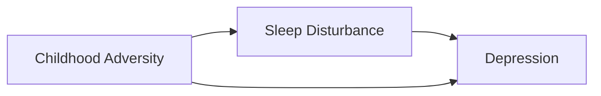
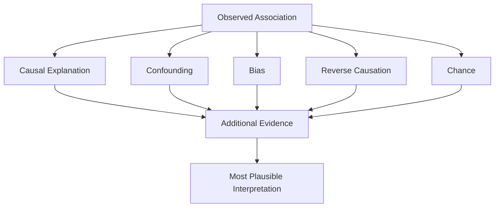

# Chapter 3: Should You Believe the Result?

> *"The most important question in epidemiology is not whether an association exists. The most important question is why it exists."*

## Why This Matters

Every epidemiologic study eventually arrives at the same moment.

The analysis is complete. The tables have been generated. The figures look convincing. A statistically significant association appears.

For many new investigators, this feels like the finish line.

The exposure is associated with the outcome. The confidence interval excludes the null. The manuscript begins to take shape.

Experienced investigators often react differently.

Their first instinct is not certainty.

It is curiosity.

What produced this association?

What assumptions are required to interpret it?

Could something else explain it?

These questions sit at the heart of epidemiology.

Modern datasets can generate thousands of associations. Electronic health records, registries, biobanks, claims databases, and large surveys make it easier than ever to identify patterns. Discovering an association is often straightforward.

Understanding it is much harder.

An observed association may reflect:

- A causal relationship
- Confounding
- Selection bias
- Information bias
- Reverse causation
- Chance
- Some combination of the above

The challenge is not finding a pattern.

The challenge is determining which explanation is most plausible.

Throughout this chapter, we will repeatedly return to a simple observation:

> Individuals with chronic sleep disturbance have higher rates of depression.

Suppose a large observational study reports this finding.

Should we conclude that sleep disturbance causes depression?

Perhaps.

But before accepting that explanation, an epidemiologist begins asking additional questions. Could depression itself be causing sleep disturbance? Could trauma increase the likelihood of both? Could differences in healthcare utilization influence who receives a diagnosis? Could measurement decisions affect the result?

Learning to ask these questions is one of the most important skills in research.

---

## Associations Are Not Explanations

One of the easiest mistakes in research is to confuse an association with an explanation.

An association tells us that two variables occur together more often than expected.

It does not automatically tell us why.

Imagine a study finds that people who carry lighters have higher rates of lung cancer.

The association is real.

The explanation is not that lighters cause cancer.

Smoking is the underlying factor connecting the two.

The same principle applies throughout medicine and psychiatry.

Suppose social isolation is associated with cognitive decline.

Several explanations are immediately plausible.

Social isolation may contribute to cognitive decline. Early cognitive decline may lead individuals to withdraw socially. Chronic illness may contribute to both. Multiple mechanisms may operate simultaneously.

The observed association alone cannot distinguish among these possibilities.

This is why epidemiology focuses so heavily on alternative explanations.

The association is not the conclusion of the investigation.

It is the beginning.

---

## What Experienced Investigators Do Differently

When new investigators encounter a statistically significant finding, they often ask:

> Is this real?

Experienced investigators tend to ask a different question:

> What else could explain this?

That shift represents one of the most important transitions in scientific thinking.

Consider the sleep and depression example.

A novice interpretation might be:

> Sleep disturbance is associated with depression. Therefore sleep disturbance increases depression risk.

An experienced investigator immediately begins generating competing explanations.

- Could depression disrupt sleep?
- Could trauma contribute to both?
- Could medication use influence both?
- Could healthcare utilization influence detection?
- Could measurement decisions affect classification?
- Could selection processes shape the study population?

The investigator is not dismissing the finding.

The investigator is stress-testing it.

Good epidemiologists actively search for explanations that challenge their preferred interpretation. The goal is not to destroy every result. The goal is to determine which explanation survives the strongest scrutiny.

Whenever you encounter an association, ask:

> If my preferred explanation is wrong, what else could explain this pattern?

That single question will improve your scientific reasoning more than memorizing dozens of statistical tests.

---

## Confounding

Confounding is one of the most important concepts in epidemiology because it reminds us that associations can be misleading.

A confounder is a factor associated with both an exposure and an outcome that can distort the observed relationship between them.

The classic example involves ice cream sales and drowning deaths.

Both increase during summer months.

If we examined only the association, we might conclude that ice cream consumption somehow increases drowning risk.

The true explanation is temperature.

Warm weather increases both swimming activity and ice cream consumption. Temperature is the confounder.

Psychiatric epidemiology contains many similar examples.

Return to sleep disturbance and depression.

One possible explanation is that sleep disturbance contributes to depression. Another possibility involves childhood adversity. Individuals exposed to adversity often experience chronic sleep problems and elevated depression risk. If adversity is not measured adequately, part of the observed association may actually reflect trauma.

Confounding creates stories that look causal but are incomplete.

The investigator's job is to determine whether the story being told by the data is the correct one.

---

## Selection Bias

Even perfect measurements can produce misleading conclusions if the wrong people enter a study.

Selection bias occurs when inclusion into a study is related to the variables being investigated.

Imagine a survey-based study of depression among college students.

Participation is voluntary. Students experiencing severe depression may be less likely to complete the survey because they are overwhelmed or disengaged. At the same time, students particularly interested in mental health may be more likely to participate.

The resulting sample may not accurately represent the broader student population.

The measurements themselves may be excellent.

The problem lies in who was included.

Large datasets are not immune to selection bias. Biobanks, registries, and research cohorts often require awareness, willingness to participate, and continued engagement. Participants may differ systematically from nonparticipants.

Whenever you evaluate a study, ask:

> Who entered the study?

Immediately follow with:

> Who did not?

The answer often reveals important limitations.

---

## Information Bias

Not all errors arise from who enters a study.

Some arise from how information is collected.

Information bias occurs when measurements are systematically inaccurate.

Unlike random error, which creates noise, information bias creates distortion.

Psychiatric epidemiology is especially vulnerable because many exposures and outcomes cannot be measured directly.

Consider childhood adversity. Researchers frequently rely on retrospective self-report. Individuals experiencing depression may remember or report adverse experiences differently than individuals without depression.

This can influence the observed association.

Common forms of information bias include:

- Recall bias
- Diagnostic bias
- Documentation bias
- Interviewer bias

Information bias often remains invisible because the dataset appears complete. The variables exist. The sample size is large. Yet the measurements may not accurately reflect reality.

For this reason, experienced investigators spend substantial time understanding how variables were created before interpreting findings.

---

## Reverse Causation

One of the most common interpretation errors involves reverse causation.

Researchers observe an association and assume the exposure caused the outcome.

The opposite may be true.

Sleep disturbance and depression provide an excellent example.

Suppose a study finds that individuals with poor sleep have higher rates of depression.

One interpretation is:

> Sleep disturbance increases depression risk.

Another interpretation is:

> Depression disrupts sleep.

Both are biologically plausible.

Both may occur simultaneously.

This problem appears repeatedly in observational research.

Physical activity and chronic disease.

Social isolation and dementia.

Weight loss and cancer.

Whenever possible, investigators should ask:

> Which came first?

Temporality is a cornerstone of causal inference.

Without it, interpretation becomes substantially more difficult.

---

## A Worked Example: Building Alternative Explanations

Suppose a study reports:

> Sleep disturbance is associated with depression.

Many readers immediately focus on the most intuitive explanation.

Sleep disturbance contributes to depression.

An epidemiologist deliberately generates alternatives.

| Possible Explanation | What Evidence Would Strengthen It? |
|---------------------|------------------------------------|
| Sleep causes depression | Longitudinal evidence showing sleep problems precede depression |
| Depression causes sleep problems | Evidence that depressive symptoms emerge first |
| Trauma causes both | Adjustment for trauma substantially reduces the association |
| Healthcare utilization influences detection | Association weakens after accounting for healthcare use |
| Measurement decisions influence results | Findings change under alternative definitions |
| Multiple mechanisms operate simultaneously | Different explanations supported across studies |

Notice what is happening.

The goal is not to identify a favorite explanation immediately.

The goal is to compare competing explanations systematically.

Scientific reasoning often involves ranking possibilities rather than proving a single explanation with certainty.

---

## Mediation

Mediation differs from confounding.

A confounder provides an alternative explanation.

A mediator helps explain how an exposure influences an outcome.

Consider:

Childhood adversity → Sleep disturbance → Depression

In this example, sleep disturbance may represent part of the pathway through which adversity influences depression risk.

Understanding mediation allows investigators to move beyond asking whether an association exists and begin asking how it operates.

Mechanisms often provide the most clinically useful insights because they identify potential intervention targets.

---

## Collider Bias

Collider bias is one of the most unintuitive concepts in epidemiology.

A collider is a variable influenced by both an exposure and an outcome. Conditioning on that variable can create misleading associations.

The important lesson is not memorizing every technical detail.

The important lesson is recognizing that adjustment is not automatically beneficial.

Many trainees learn that adding variables improves analyses.

Sometimes it does.

Sometimes it introduces new bias.

The challenge is determining which variables should be adjusted for and which should not.

---

## Directed Acyclic Graphs (DAGs)

Directed acyclic graphs, or DAGs, help investigators make assumptions explicit.

A DAG is not a statistical model.

It is a conceptual model.

The value of a DAG is not that it proves a relationship exists.

Its value is that it forces investigators to articulate assumptions before analysis begins.

DAGs help researchers:

- Identify confounders
- Recognize mediators
- Avoid inappropriate adjustment
- Clarify causal reasoning

One of the most useful habits in research is drawing a conceptual model before opening statistical software.

---

## Healthcare Utilization

Healthcare utilization is one of the most important sources of bias in modern observational research.

Individuals who interact frequently with healthcare systems accumulate more diagnoses, more procedures, more laboratory values, and more opportunities for disease detection.

As a result, apparent differences in disease burden may partially reflect differences in opportunities for diagnosis.

Imagine comparing two groups.

One group visits healthcare providers frequently.

The other rarely seeks care.

Even if their true disease burden is identical, the first group may appear substantially sicker because more conditions are identified and documented.

This issue is especially important in:

- Electronic health records
- Claims databases
- Registry studies
- Psychiatric epidemiology

Researchers should therefore ask:

> Am I measuring disease, or am I measuring opportunities for disease detection?

The distinction is often more important than it first appears.

---

## Statistical Significance Is Not Enough

Many trainees are taught to focus heavily on p-values.

P-values are useful.

They are not sufficient.

A statistically significant finding may still be:

- Confounded
- Biased
- Clinically trivial
- Poorly measured
- Difficult to interpret

Similarly, a non-significant finding may still be informative.

Scientific importance and statistical significance are not the same thing.

Whenever you encounter a significant result, ask:

- How large is the effect?
- How precise is the estimate?
- Could bias explain the finding?
- Is it clinically meaningful?
- Does it fit with existing evidence?

Statistical significance is one piece of evidence.

It is not the entire argument.

---

## Intellectual Humility

One of the most important characteristics of effective investigators is intellectual humility.

Early in training, research can appear deceptively straightforward. A result appears. An interpretation follows. A conclusion is drawn.

Experience gradually reveals how many assumptions support even simple findings.

Questions emerge.

What alternative explanations remain?

What biases are possible?

What assumptions were required?

What evidence would change my mind?

These questions do not reflect weakness.

They reflect scientific maturity.

Confidence is valuable.

Overconfidence is dangerous.

The strongest investigators remain willing to revise their conclusions when new evidence emerges.

---

## Figure: Evaluating an Association

The investigator's task is not simply to identify an association.

The investigator's task is to determine which explanation is most plausible.

---

## Reading Assignment

**Classic Reading:**

[Placeholder for future reading assignment]

**Modern Applied Example:**

[Placeholder for future reading assignment]

---

## Building Your Project

### Step 1

Identify an observed association.

### Step 2

Generate at least three alternative explanations.

### Step 3

Identify evidence that would strengthen each explanation.

### Step 4

Identify evidence that would weaken each explanation.

### Step 5

Evaluate which interpretation is most plausible.

---

## Investigator's Notebook

Answer the following:

- What explanation am I currently favoring?
- What evidence supports it?
- What evidence challenges it?
- What alternative explanations remain plausible?
- What evidence would change my interpretation?

---

## Questions Worth Carrying Forward

1. Why does this association exist?
2. What alternative explanations remain possible?
3. What assumptions am I making?
4. What evidence would change my interpretation?
5. Am I becoming overconfident?

The next chapter expands the discussion beyond individuals and asks a broader question:

> Why do health outcomes differ across populations?
