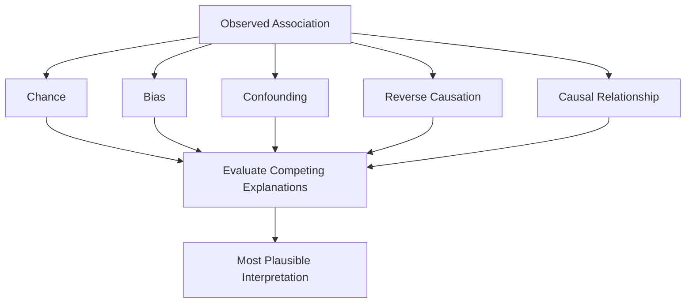

# Chapter 3: Should You Believe the Result?

> *"The most important question in epidemiology is not whether an association exists. The most important question is why it exists."*

## Why This Matters

Imagine that you have just completed your first major research project.

The question seemed important. The dataset was large. You spent weeks refining definitions, cleaning variables, troubleshooting analyses, and revising models. Eventually the work is finished and the results appear exactly as you hoped. The exposure is associated with the outcome. The confidence interval excludes the null. The p-value is reassuringly small.

For many new investigators, this feels like the moment when the study finally produces an answer.

In reality, it is often the moment when the most interesting questions begin.

One of the first surprises of research is that identifying an association and understanding an association are not the same thing. Modern datasets make it increasingly easy to find patterns. Electronic health records, national registries, wearable devices, claims databases, and biobanks contain enormous amounts of information. Given enough variables and a sufficiently large sample size, statistically significant findings are rarely difficult to generate.

What remains difficult is determining what those findings mean.

Suppose a study reports that individuals with chronic sleep disturbance are more likely to develop depression. The result may be entirely real. The association may replicate across multiple datasets and appear in dozens of published studies. Yet even after accepting the observation itself, an important question remains unresolved.

Why does the relationship exist?

At first glance, the answer may appear obvious. Poor sleep could plausibly contribute to depression through multiple biological and psychological pathways. But the longer one thinks about the problem, the more possibilities emerge. Depression itself frequently disrupts sleep. Childhood adversity increases the likelihood of both sleep problems and depression later in life. Chronic medical illness can influence both. Social and economic stressors may contribute to each. Even the process of seeking healthcare can affect who receives diagnoses and how those diagnoses enter a dataset.

The observed association remains unchanged. What changes is our appreciation of how many explanations might account for it.

This habit of generating alternative explanations sits at the center of epidemiologic thinking. While other disciplines may focus primarily on discovering relationships, epidemiology has traditionally focused on evaluating competing explanations for those relationships. The goal is not merely to identify patterns. The goal is to determine which interpretation is most consistent with the available evidence.

This distinction is worth emphasizing because many studies are written in a way that makes scientific discovery appear far more straightforward than it actually is. Journal articles often present a clean narrative. A question is introduced, a study is conducted, a result is observed, and a conclusion is offered. The uncertainty, doubt, and competing interpretations that occupied the investigators throughout the project rarely receive the same amount of attention.

Yet those uncertainties are often where the real scientific work occurs.

Strong investigators learn to become slightly uncomfortable whenever a result appears too simple. They develop the habit of pausing before accepting the most obvious explanation and asking whether other possibilities deserve consideration. Over time, this habit becomes almost automatic. A finding appears, and the mind immediately begins generating alternative interpretations.

Rather than weakening scientific conclusions, this process strengthens them. Explanations that survive serious scrutiny are far more convincing than explanations that are accepted simply because they were the first to come to mind.

The purpose of this chapter is not to teach cynicism or distrust. Scientific progress depends on evidence, and evidence deserves to be taken seriously. The goal is something more subtle. It is to cultivate a form of intellectual discipline that allows investigators to remain curious even when a result appears convincing.

That discipline begins with a simple question:

Why does this association exist?

## Associations and Explanations

Much of epidemiology can be understood as the distinction between observations and explanations.

An observation describes a pattern. An explanation attempts to account for why the pattern exists.

Although the distinction sounds straightforward, it is one of the easiest ideas to lose sight of when interpreting research findings.

Consider a familiar example. Researchers observe that individuals who carry lighters have substantially higher rates of lung cancer than individuals who do not. The association is real and easily demonstrated. Yet very few people would conclude that carrying a lighter causes cancer. The explanation lies elsewhere. Smoking increases the likelihood that someone carries a lighter and independently increases the likelihood of developing lung cancer. The lighter is associated with the outcome, but it is not responsible for producing it.

The lesson is not really about smoking or lighters. It is about the danger of treating an observed relationship as though it automatically reveals its own explanation.

The same challenge appears repeatedly throughout medicine and psychiatry. Researchers may observe that social isolation is associated with cognitive decline, that sleep disturbance is associated with depression, or that childhood adversity is associated with cardiovascular disease. In each case, the association itself is only the beginning of the story. The more difficult task is determining whether the proposed explanation is the most plausible one.

This is why epidemiologists spend so much time thinking about alternative explanations. The central question is rarely whether an association exists. The central question is whether the explanation being offered deserves our confidence.

As a result, experienced investigators often approach published findings differently than trainees. New researchers frequently read studies looking for answers. More experienced investigators often read studies looking for assumptions. They want to understand what had to be true for the authors' interpretation to be correct. They look for competing explanations, potential biases, alternative causal pathways, and unanswered questions.

In many ways, epidemiology is the practice of slowing down before accepting an explanation that appears obvious.

The remainder of this chapter explores several of the most common reasons why observed associations can be misleading, along with the tools investigators use to evaluate competing interpretations.

## Confounding: The Great Impostor

If there is one concept that has humbled generations of researchers, it is confounding.

Most investigators encounter confounding early in their training. They learn a formal definition, memorize a few classic examples, and move on. Unfortunately, this often creates the impression that confounding is a technical nuisance rather than one of the central challenges of scientific reasoning.

In reality, confounding is important because it exploits one of our most natural intellectual tendencies. Human beings are remarkably good at recognizing patterns, but we are often too eager to explain them. When two variables appear together repeatedly, we instinctively begin constructing stories about why. Confounding reminds us that the most obvious story is not always the correct one.

Imagine that a study reports an association between sleep disturbance and depression. One interpretation is that chronic sleep problems contribute to depression risk. The explanation feels plausible. Sleep affects mood, cognition, stress regulation, and countless biological processes. Most readers would find the conclusion entirely reasonable.

Now imagine that childhood adversity increases the likelihood of both chronic sleep disturbance and depression later in life. Individuals exposed to adversity are more likely to experience sleep problems, and they are also more likely to develop depression. If adversity is not adequately measured, part of the observed relationship between sleep and depression may actually reflect the influence of trauma.

The original association remains unchanged. The interpretation becomes far more complicated.

This is what makes confounding so challenging. It rarely produces absurd explanations. More often, it produces explanations that feel entirely believable. The resulting story may contain elements of truth while still being incomplete.

One way to think about confounding is to imagine arriving at the scene of an event after it has already occurred. You can observe the outcome, examine the evidence, and reconstruct possible explanations, but you do not have direct access to the sequence of events themselves. Some explanations will fit the observations better than others, yet multiple possibilities often remain plausible.

Epidemiologic studies frequently place investigators in a similar position. We observe relationships among variables and attempt to infer what produced them. Confounding represents the possibility that an unseen factor has influenced the story in ways we do not fully appreciate.

The challenge becomes even greater in psychiatric epidemiology because many exposures and outcomes share common causes. Trauma, socioeconomic conditions, chronic illness, healthcare access, social support, substance use, and genetic liability can influence multiple aspects of health simultaneously. As a result, psychiatric research is often filled with variables that are deeply interconnected.

This complexity explains why adjustment is such an important part of epidemiologic analysis. Researchers attempt to account for factors that may distort the relationship under investigation. Yet even sophisticated adjustment strategies have limitations. Investigators can only adjust for variables that are measured, available, and reasonably understood. Unknown or poorly measured confounders remain a persistent concern in observational research.

For this reason, strong epidemiologists rarely ask whether confounding has been eliminated. That standard is usually unattainable. Instead, they ask whether confounding provides a more plausible explanation for the observed association than the explanation currently being proposed.

The distinction is subtle but important. Epidemiology is often less about proving a single explanation and more about comparing competing explanations and determining which appears most consistent with the evidence.

## The Question Experienced Investigators Ask

As trainees gain experience, many discover that their approach to reading papers begins to change.

Early in training, it is common to focus primarily on findings. A study reports an association, and attention naturally shifts to the effect size, confidence interval, or p-value. The result itself occupies center stage.

With experience, another question begins to emerge:

What would have to be true for this interpretation to be wrong?

This question appears repeatedly in scientific reasoning because it forces investigators to move beyond the authors' preferred explanation and actively search for alternatives.

Suppose a study reports that individuals who exercise regularly have lower rates of depression. The finding is plausible and supported by substantial literature. Yet before accepting the interpretation, an epidemiologist might begin exploring other possibilities.

Could depression reduce the likelihood of exercise rather than exercise reducing the likelihood of depression? Could chronic illness influence both physical activity and mood? Could socioeconomic conditions shape access to recreational opportunities, healthcare, nutrition, and stress exposure in ways that influence both variables? Could the association be stronger among individuals who regularly engage with healthcare systems and therefore have more opportunities for documentation?

Notice that none of these questions requires rejecting the original hypothesis. The purpose is not to dismiss evidence. The purpose is to evaluate whether alternative explanations deserve consideration.

Scientific reasoning often progresses through this process of deliberate skepticism. Rather than asking whether a favored explanation is possible, investigators ask whether it remains convincing after competing explanations have been carefully examined.

This habit can feel uncomfortable at first because it introduces uncertainty into situations that initially appeared straightforward. Over time, however, it becomes one of the most valuable tools an investigator possesses. Findings that continue to make sense after alternative explanations have been explored are far more persuasive than findings that are accepted immediately.

The strongest researchers are not necessarily the people who generate the most explanations.

They are the people who remain willing to challenge their own explanations.

## When Reality Enters the Dataset

One of the easiest assumptions to make in research is that a dataset provides a direct representation of reality.

After all, the dataset contains people, diagnoses, medications, laboratory values, procedures, and outcomes. It feels tangible. The information appears objective. Once the data have been assembled, it is tempting to focus entirely on analysis and interpretation.

Experienced investigators spend a surprising amount of time thinking about something else.

They think about how the information entered the dataset in the first place.

This may sound like a minor concern, but it has enormous implications for how research findings should be interpreted. Before any statistical model is fit, a long sequence of events has already occurred. Individuals must seek care. Clinicians must recognize symptoms. Diagnoses must be documented. Data must be coded, stored, extracted, and harmonized. Participants must choose to enroll in studies. Survey respondents must decide whether to answer questions. Each step creates opportunities for information to be lost, distorted, or represented unevenly.

As a result, datasets rarely provide a perfect snapshot of reality. More often, they provide a record of reality filtered through a series of human, clinical, and administrative processes.

Recognizing those processes is one of the most important skills in epidemiology.

## Selection Bias: Who Appears in the Study?

Whenever you read a paper, one of the first questions worth asking is deceptively simple:

Who is represented here?

A closely related question follows immediately:

Who is missing?

Selection bias occurs when inclusion into a study is related to the variables being investigated. In practical terms, this means that the people who appear in the dataset differ in meaningful ways from the people who do not.

The concept is easy to understand in theory but surprisingly difficult to recognize in practice because the missing individuals are often invisible.

Imagine a survey-based study examining depression among college students. Participation is voluntary. Students who are overwhelmed, socially withdrawn, or struggling academically may be less likely to complete the survey. At the same time, students with a particular interest in mental health may be more likely to participate.

The resulting sample may still contain thousands of respondents. The data may be meticulously collected. Yet the study population may not fully represent the broader student body.

The challenge becomes even more complicated in large observational datasets.

Consider a biobank such as All of Us or UK Biobank. Participation requires awareness of the study, willingness to enroll, and continued engagement over time. Individuals who volunteer for research often differ from those who do not. They may have different health behaviors, educational backgrounds, healthcare access, or motivations for participation.

None of this invalidates the data. It simply means that investigators must think carefully about who entered the study and why.

The question is not whether selection occurred. Selection occurs in every study.

The question is whether the selection process influences the conclusions being drawn.

## Information Bias: When Measurements Drift Away From Reality

Not all problems arise from who enters a study.

Some arise from the information collected after they arrive.

Chapter 2 focused on measurement and emphasized that variables are representations of underlying concepts rather than direct observations of reality. Information bias emerges when those representations systematically differ from the phenomenon they are intended to capture.

Psychiatric epidemiology provides many examples.

Researchers studying childhood adversity often rely on retrospective self-report. Participants may forget experiences, reinterpret them over time, or differ in their willingness to disclose sensitive information. Studies examining psychiatric diagnoses may depend on documentation practices that vary across clinicians, healthcare systems, and patient populations.

Importantly, information bias is often difficult to detect because the resulting data may appear complete and internally consistent. The variable exists. The sample size is large. The analysis runs without difficulty.

Nothing about the spreadsheet announces that a problem has occurred.

This is one reason experienced investigators spend substantial time learning how variables were generated. They want to understand who recorded the information, under what circumstances, for what purpose, and with what limitations.

A variable rarely speaks for itself.

Its meaning depends heavily on how it came into existence.

## The Hidden Influence of Healthcare Utilization

One of the most important forms of bias in modern observational research receives surprisingly little attention during traditional research training.

Healthcare utilization influences nearly everything that appears in an electronic health record.

At first glance, this seems obvious. People who interact with healthcare systems generate healthcare data. Yet the implications are profound.

Imagine two individuals with identical underlying health profiles. One sees physicians regularly, completes preventive screenings, visits specialists, undergoes laboratory testing, and maintains frequent contact with the healthcare system. The other rarely seeks care except during emergencies.

From the perspective of an EHR dataset, these individuals may look remarkably different.

The first person accumulates diagnoses, medications, laboratory values, referrals, and documented conditions. The second accumulates far less information, even if their underlying disease burden is similar.

As a result, apparent differences in health may sometimes reflect differences in opportunities for detection.

This issue becomes particularly important when studying psychiatric conditions. Diagnoses such as depression, anxiety, PTSD, or substance use disorders require recognition, documentation, and coding before they appear in structured data. Individuals who engage more frequently with healthcare systems have more opportunities for this process to occur.

Researchers therefore face an important question:

Are we observing differences in disease burden, or differences in opportunities for disease detection? The answer is often some combination of both.

This realization has important implications for studies using electronic health records, claims data, and registry-based resources. Variables that appear straightforward may actually reflect a mixture of biology, behavior, healthcare access, clinician recognition, documentation practices, and system-level processes. Understanding these influences does not weaken observational research. If anything, it strengthens it.

The strongest investigators are not the ones who ignore these complexities. They are the ones who recognize them, account for them when possible, and discuss them honestly when interpreting their findings.

## Reverse Causation: Which Came First?

One of the reasons observational research can be so challenging is that time does not always reveal itself clearly within a dataset.

When we observe an association between two variables, our instinct is often to imagine a particular direction of influence. An exposure affects an outcome. A risk factor contributes to disease. A behavior changes health.

Sometimes that interpretation is correct.

Sometimes the arrows point in the opposite direction.

Consider once again the relationship between sleep disturbance and depression. Many investigators are interested in whether chronic sleep problems increase the likelihood of developing depression later in life. The hypothesis is biologically plausible, clinically relevant, and supported by substantial evidence.

Yet anyone who has worked with patients knows that depression itself frequently disrupts sleep.

A cross-sectional study observing an association between sleep disturbance and depression therefore faces an important challenge. Does poor sleep contribute to depression? Does depression contribute to poor sleep? Are both processes occurring simultaneously?

Without careful attention to timing, these possibilities can be difficult to distinguish.

The same challenge appears throughout medicine. Weight loss may appear to predict disease when the disease itself caused the weight loss. Reduced physical activity may appear to increase health risks when early illness caused individuals to become less active. Social isolation may appear to precede cognitive decline when subtle cognitive changes actually initiated social withdrawal years earlier.

None of these explanations are inherently unreasonable. That is precisely what makes reverse causation so dangerous.

The problem is not that the alternative explanation is implausible.

The problem is that it is plausible.

Strong investigators therefore spend considerable time thinking about temporality. They want to know what happened first. They examine study design, follow-up periods, baseline exclusions, and sensitivity analyses. They ask whether the proposed cause truly preceded the proposed effect.

Whenever you encounter a finding, it is worth pausing for a moment and asking a simple question:

> If I reversed the direction of this explanation, would the result still make sense?

More often than you might expect, the answer is yes.

## Building Competing Explanations

One of the most useful habits in epidemiology is learning to treat explanations as competitors rather than conclusions.

New investigators often approach studies as exercises in confirmation. A hypothesis is proposed, a dataset is analyzed, and the resulting evidence is used to determine whether the hypothesis was supported.

There is nothing inherently wrong with this approach. Yet it sometimes creates the impression that the investigator's job is to defend a preferred explanation.

In reality, the opposite mindset is often more productive.

Imagine that you have completed a study demonstrating that individuals with chronic sleep disturbance experience higher rates of depression.

Rather than immediately defending a single interpretation, consider generating several plausible explanations.

Perhaps sleep disturbance contributes directly to depression risk.

Perhaps depression contributes to sleep disturbance.

Perhaps trauma influences both.

Perhaps socioeconomic stressors influence both.

Perhaps healthcare utilization increases the likelihood that both conditions are documented.

Perhaps multiple explanations operate simultaneously.

At this stage, the goal is not to decide which explanation is correct. The goal is to make sure alternative explanations are being considered at all.

This process can feel uncomfortable because it introduces uncertainty into findings that initially appeared straightforward. Yet uncertainty is often where the most valuable scientific thinking occurs. Once competing explanations are identified, investigators can begin evaluating which explanations best fit the available evidence.

The process resembles detective work more than many people realize.

Detectives rarely stop after identifying a single plausible suspect. They actively seek evidence capable of distinguishing among competing possibilities. Scientific reasoning often proceeds in much the same way. The strongest explanation is not necessarily the first one proposed. It is the one that remains most convincing after alternatives have been carefully examined.

Over time, experienced investigators develop the habit of constructing these alternative explanations automatically. When they read a paper, attend a presentation, or review a manuscript, their minds naturally begin asking what else could account for the observed findings.

This habit is one of the defining characteristics of epidemiologic thinking.

## Thinking About Causality

At some point, nearly every research project arrives at the same destination.

After considering confounding, bias, reverse causation, and alternative explanations, investigators inevitably return to a fundamental question:

Could this relationship actually be causal?

The question is deceptively simple.

Most people use causal language comfortably in everyday life. We say that smoking causes lung cancer, that exercise improves health, or that vaccinations reduce infectious disease risk. Yet establishing causality scientifically is often extraordinarily difficult.

One reason is that causal relationships themselves are rarely observed directly. What we observe are patterns in data. From those patterns, we attempt to infer whether changing one factor would alter another.

This distinction helps explain why epidemiologists devote so much effort to study design. Randomized trials, longitudinal cohorts, natural experiments, instrumental variables, and other approaches all represent attempts to strengthen causal inference by reducing the influence of competing explanations.

Importantly, causality is rarely an all-or-nothing concept.

Researchers often accumulate evidence gradually. Findings are replicated across populations. Alternative explanations become less convincing. Different study designs converge on similar conclusions. Biological mechanisms become clearer. Confidence grows over time.

Smoking did not become accepted as a cause of lung cancer because of a single study. The conclusion emerged from decades of evidence evaluated across multiple disciplines and research designs.

Most scientific questions are less dramatic, but the principle remains the same. Causal inference is often best understood as a process of progressively increasing confidence rather than achieving absolute certainty.

For this reason, experienced investigators are often careful with causal language. They recognize that evidence exists along a continuum. Some relationships are strongly supported. Others remain uncertain. Many fall somewhere in between.

The goal is not to avoid causal thinking. The goal is to approach causal claims with the level of humility that complex biological and social systems deserve.

## Visualizing Explanations

As epidemiology has become increasingly interested in causal reasoning, investigators have developed tools to help visualize competing explanations.

One of the most useful is the Directed Acyclic Graph, commonly abbreviated as a DAG.

At first glance, DAGs can appear intimidating. Entire courses are devoted to their construction and interpretation. For the purposes of this handbook, however, the most important insight is remarkably simple.

A DAG is a way of making assumptions visible.

Every study contains assumptions about how variables relate to one another. Investigators may believe that trauma influences depression, that sleep disturbance influences mood, or that socioeconomic conditions influence both. Whether these assumptions are written down or not, they shape decisions about study design, analysis, and interpretation.

DAGs simply provide a structured way to represent those ideas.

Rather than keeping causal assumptions hidden in our heads, we place them on paper and examine them directly. Once the assumptions become visible, they can be challenged, refined, and discussed.

For this reason, DAGs are often most valuable before an analysis begins. They encourage investigators to think carefully about alternative explanations and identify variables that may require adjustment.

The power of a DAG does not come from the diagram itself.

It comes from the thinking required to create it.

## Confounders, Mediators, and Colliders

As investigators begin thinking more explicitly about causal pathways, several important types of variables emerge.

Confounders are variables that influence both an exposure and an outcome. They create alternative explanations for observed associations and therefore often require adjustment.

Mediators occupy a different position. Rather than creating alternative explanations, they help explain how an exposure influences an outcome. If chronic stress contributes to depression through sleep disruption, then sleep disturbance may function as part of the pathway connecting stress and depression.

Colliders are often the most counterintuitive variables. They are influenced by two or more factors simultaneously. Adjusting for a collider can sometimes introduce bias rather than remove it, creating associations that would not otherwise exist.

The details of these concepts become increasingly important as investigators advance their training. For now, the key lesson is broader.

Variables occupy different positions within a causal system.

Not every variable should be adjusted for.

Not every variable should be ignored.

Thoughtful adjustment requires understanding how variables relate to one another rather than automatically including every available measure in a statistical model.

## Why Statistical Significance Is Not Enough

Many students enter research believing that statistical significance is the final arbiter of scientific truth.

The idea is understandable. Statistical tests are objective, reproducible, and widely reported. A significant result appears to provide a clear answer.

Yet statistical significance was never intended to answer the question that most investigators actually care about.

It does not tell us whether an explanation is correct.

It does not eliminate confounding.

It does not eliminate bias.

It does not establish causality.

It does not guarantee clinical importance.

What it provides is information about the compatibility of the observed data with a particular statistical model.

That information can be useful. It can also be easily misunderstood.

Consider a very large dataset containing hundreds of thousands of participants. Even trivial differences may become statistically significant. Conversely, meaningful relationships may fail to reach conventional significance thresholds in smaller studies.

The interpretation of evidence therefore requires much more than examining a p-value.

Experienced investigators consider study design, measurement quality, biological plausibility, consistency with prior literature, potential biases, alternative explanations, effect sizes, confidence intervals, and clinical relevance. Statistical significance becomes one piece of evidence among many rather than the sole determinant of credibility.

This distinction is important because science progresses through the accumulation of evidence, not through individual p-values.

## Intellectual Humility

At this point, the chapter may seem overwhelmingly skeptical.

Confounding can distort associations. Bias can influence results. Reverse causation can complicate interpretation. Measurement limitations can alter conclusions. Statistical significance can be misleading.

Faced with these realities, some readers begin to wonder whether any result can truly be trusted.

The answer is yes.

But trust in science emerges differently than many people initially imagine.

Scientific confidence is rarely built upon perfect studies. Perfect studies do not exist. Every project contains limitations, assumptions, and uncertainties. Instead, confidence develops when multiple lines of evidence converge toward similar conclusions despite those limitations.

Different study designs point in the same direction. Findings replicate across populations. Alternative explanations become less convincing. Mechanisms become clearer. Confidence accumulates gradually.

This process requires a certain degree of humility.

Humility does not mean refusing to draw conclusions. It means recognizing that conclusions are always conditional upon the available evidence. It means remaining open to revision when new information emerges. It means acknowledging uncertainty without becoming paralyzed by it.

In many ways, humility is one of the defining characteristics of strong investigators.

The most experienced researchers are often remarkably comfortable saying:

> Based on the available evidence, this appears to be the most plausible explanation.

Notice what is absent from that statement.

Certainty.

Science does not require certainty to make progress. It requires careful reasoning, thoughtful interpretation, and a willingness to update conclusions as evidence evolves.

*Figure 3.1. Epidemiologic reasoning begins with an observed association and proceeds through a process of evaluating competing explanations. The goal is not to prove a preferred explanation immediately, but to determine which interpretation is most consistent with the available evidence.*

## Reading Assignment

### Modern Applied Example

**Ioannidis JPA. (2005).** *Why Most Published Research Findings Are False.*

📄 **Read the paper:** [Ioannidis (2005)](../papers/Ioannidis_2005_Paper.pdf)

As you read, focus less on the statistical details and more on the broader argument about scientific evidence. Throughout this chapter, we have explored the idea that an observed association is not automatically an explanation. Confounding, bias, reverse causation, measurement limitations, chance, and selective reporting can all contribute to findings that appear convincing at first glance.

The central question of the paper is remarkably similar to the central question of this chapter:

> When should we believe a result?

Ioannidis argues that statistical significance alone is often insufficient and that scientific credibility depends on many factors beyond a single study's findings. As you read, think about how the concepts discussed in this chapter might influence the likelihood that a result is ultimately replicated and accepted by the broader scientific community.

### Reflection Questions

1. What does Ioannidis mean when he argues that some published findings may be false despite being statistically significant?

2. Which concepts from this chapter appear most prominently in the paper? Consider confounding, bias, measurement limitations, reverse causation, selective reporting, and chance.

3. Can a study be carefully conducted and still produce a misleading conclusion? Why or why not?

4. How does the paper change the way you think about statistical significance?

5. What additional questions would you ask when evaluating a published study after reading this paper?

6. Does the paper make you more skeptical of scientific findings, more thoughtful about scientific findings, or both?

7. What is the difference between scientific skepticism and cynicism?

### Why This Paper Matters

One of the most important transitions in becoming an investigator occurs when you stop asking:

> Is this result statistically significant?

and begin asking:

> What explanation is most consistent with the evidence?

The goal of epidemiology is not simply to identify associations. It is to evaluate competing explanations and determine which interpretation is most plausible given the available data.

The Ioannidis paper serves as a reminder that scientific findings should not be accepted automatically, even when they appear convincing. Strong investigators remain willing to challenge assumptions, consider alternative explanations, and revise conclusions when new evidence emerges.

Scientific skepticism is not the rejection of evidence.

It is the careful evaluation of evidence before deciding what to believe.

## Building Your Project

Return once again to the research question you developed in Chapters 1 and 2.

At this stage, resist the urge to focus on analysis. Instead, focus on explanation.

Suppose your study finds exactly the result you expect.

What would the result mean?

More importantly, what other explanations might account for the finding?

Try to identify at least three alternative explanations for your anticipated association. Consider confounding factors, measurement limitations, selection processes, healthcare utilization patterns, and the possibility of reverse causation.

Then ask yourself an important question:

What evidence would make each explanation more or less plausible?

The purpose of this exercise is not to undermine your hypothesis. The purpose is to strengthen your ability to interpret findings thoughtfully once they emerge.

## Investigator's Notebook

### Reflection 1

Think about a published study that you found convincing.

What explanation did the authors propose?

Can you identify at least two alternative explanations that might also account for the observed findings?

### Reflection 2

Consider a common association in medicine or psychiatry.

How might confounding influence the relationship?

What variables would you want to measure if you were designing the study yourself?

### Reflection 3

Imagine that your own project produces a statistically significant result.

What questions would you ask before accepting your preferred interpretation?

How would you determine whether competing explanations have been adequately considered?

## Questions Worth Carrying Forward

The previous chapter emphasized that variables are representations of reality rather than reality itself. This chapter adds another layer to that lesson.

Even when variables are measured thoughtfully and analyses are conducted correctly, observed associations do not automatically reveal their own explanations.

Scientific reasoning begins when investigators move beyond the question of whether a relationship exists and begin evaluating why it exists.

This process requires skepticism, creativity, judgment, and humility. It requires investigators to generate competing explanations, examine assumptions, and remain open to uncertainty. Most importantly, it requires the recognition that conclusions become stronger when they survive serious attempts to challenge them.

As you move into the next chapter, the focus will broaden once again.

So far, we have discussed questions, measurement, and interpretation largely at the level of individual studies. Population health research asks a larger question.

Why do patterns emerge across groups, communities, and societies in the first place?

Answering that question requires shifting from individuals to populations and learning to see health through a wider lens.

