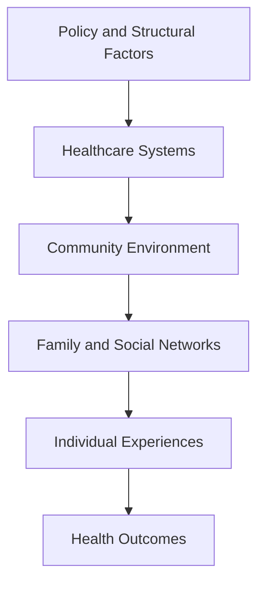

# Chapter 4: Thinking Like a Population Health Researcher

> *"Individuals experience disease. Populations experience patterns."*

## Why This Matters

Much of medicine is organized around individual people.

A patient arrives in clinic with symptoms. A diagnosis is established. A treatment plan is developed. Follow-up visits focus on how that particular individual is doing and whether the intervention is helping. The questions clinicians ask naturally reflect this perspective. Why did this patient become ill? Why did another recover? Why did one person respond to treatment while someone else with a seemingly similar condition did not?

Research often begins in exactly the same place. A surprising clinical observation sparks curiosity. A pattern begins to emerge among patients. A question develops. The first three chapters of this handbook have largely operated at this level. We have discussed how investigators formulate questions, how abstract concepts become measurable variables, and how observed associations can be interpreted thoughtfully rather than accepted at face value.

Population health begins when the frame starts to widen.

Imagine that you are studying depression in two neighboring communities. The communities are geographically close. Residents shop in many of the same stores, drive on the same highways, and live within the same metropolitan area. Yet when researchers examine the data, they find that rates of depression differ substantially between the two populations.

At first, it is tempting to think about the individuals represented in those statistics. Perhaps one community contains more people with a family history of depression. Perhaps sleep disturbance is more common. Perhaps substance use differs. These are reasonable possibilities, and some may prove important.

But after a while another question begins to emerge.

Why are those factors distributed differently across the two communities in the first place?

That question marks the beginning of population health thinking.

The shift is subtle. The outcome has not changed. Depression remains the outcome of interest. What changes is the level of explanation being considered. Rather than focusing exclusively on the factors that influence a particular person's risk, the investigator begins asking why risk itself is distributed unevenly across groups of people.

This change in perspective has shaped some of the most important discoveries in public health and epidemiology. Researchers have learned that many of the forces influencing health are difficult to see when attention remains fixed on individual patients. Educational opportunities, housing stability, economic conditions, healthcare access, neighborhood environments, public policy, and historical patterns of investment rarely appear as diagnoses in a medical record. Yet they often influence who becomes sick, who receives care, and who ultimately benefits from scientific advances.

In this sense, population health is not a rejection of individual-level explanations. Depression is still experienced by individuals. Cardiovascular disease still develops within individual bodies. Recovery, resilience, suffering, and healing remain deeply personal experiences.

What population health adds is context.

It reminds us that individuals live within families, families exist within communities, communities operate within institutions, and institutions are shaped by broader social, economic, and political systems. Health emerges from these interactions. Sometimes the most important explanation for a pattern is not found within the individual at all, but within the conditions that surround them.

One of the most influential epidemiologists of the twentieth century, Geoffrey Rose, argued that the causes of individual cases are not always the same as the causes of differences between populations. A clinician may be interested in why a particular person developed depression. A population health researcher may be equally interested in why depression is more common in one community than another. Both questions matter, but they are not interchangeable.

Learning to move between these perspectives is one of the defining skills of population health research.

The remainder of this chapter explores what happens when investigators begin looking beyond individual outcomes and start asking how larger systems shape the patterns they observe.

## Following the Pattern Upstream

One of the most useful habits a population health researcher can develop is the habit of refusing to stop at the first plausible explanation.

Consider a patient experiencing depression. Many reasonable explanations immediately come to mind. Genetics may contribute. Life stressors may play a role. Sleep disturbance, trauma exposure, substance use, social isolation, and chronic medical illness can all influence risk. A clinician caring for that patient would naturally spend time exploring these possibilities because they are directly relevant to diagnosis and treatment.

A population health researcher is interested in those explanations as well. The difference is that they often continue asking questions after an initial explanation has been identified.

Imagine that sleep disturbance appears to be an important contributor to depression risk within a particular community. That finding is informative, but it also raises another question. Why is sleep disturbance so common in the first place?

Researchers may discover that many residents work overnight shifts or rotating schedules. That observation explains part of the pattern, but it immediately invites another question. Why are so many people employed in jobs that disrupt sleep?

Perhaps the local economy depends heavily on manufacturing, transportation, healthcare, or other industries that require around-the-clock staffing. Yet even that explanation is incomplete. Why are workers concentrated in those occupations rather than others? Why are alternative employment opportunities limited? Why do some communities have greater economic flexibility than others?

As the investigation continues, the explanation expands beyond individual behaviors and begins to incorporate educational opportunities, transportation systems, housing patterns, economic development, labor markets, and public policy. Eventually, historical decisions that occurred decades earlier may become relevant to understanding a health outcome observed today.

At each stage, the explanation moves further upstream.

This process does not imply that individual-level factors are unimportant. Depression remains deeply personal. Sleep still matters. Trauma still matters. Genetics still matter. The point is that many of the factors influencing individual risk are themselves shaped by larger systems.

Population health researchers therefore become interested in both the immediate causes of disease and the conditions that make those causes more or less common within a population.

## Health Is Produced Across Multiple Levels

One reason population health can feel unfamiliar at first is that medicine often encourages us to think about causes in relatively direct ways. A disease develops because of a particular exposure, biological mechanism, or risk factor. While these explanations are often correct, they can sometimes obscure the fact that health outcomes are usually produced through interactions among many levels of influence operating simultaneously.

A person's health is shaped by their biology, but it is also shaped by family relationships, social networks, schools, workplaces, neighborhoods, healthcare systems, and public policies. These influences rarely operate independently. Instead, they interact continuously throughout the lifespan.

Consider a child growing up in a neighborhood with underfunded schools, limited access to healthcare, and high rates of housing instability. None of these factors guarantees a particular outcome. Many children thrive despite significant adversity. Yet these conditions influence educational opportunities, stress exposure, healthcare utilization, economic mobility, and countless other experiences that accumulate over time.

By adulthood, the consequences may become visible through differences in chronic disease risk, mental health outcomes, healthcare access, educational attainment, or life expectancy.

What appears to be an individual outcome often reflects years of interactions among multiple systems.

This perspective helps explain why population health researchers are often cautious about explanations that focus exclusively on individual choices. Individual decisions matter, but choices are always made within environments that create opportunities, constraints, incentives, and barriers. Understanding health therefore requires understanding both individuals and the systems within which they live.

One useful way to visualize this idea is to imagine health as emerging from a series of nested layers.



*Figure 4.1. Health outcomes emerge from interactions across multiple levels of influence. Population health researchers seek to understand how these layers shape patterns of disease, wellness, and recovery.*

## The Social Determinants of Health

The phrase *social determinants of health* appears frequently in modern medicine, public health, and epidemiology. Unfortunately, the term is sometimes reduced to a checklist of variables rather than treated as a way of understanding how health is produced.

At its core, the idea is straightforward. Health is influenced by the conditions in which people are born, grow, learn, work, live, and age. These conditions affect exposure to risk, access to resources, opportunities for advancement, and the ability to benefit from medical care.

Education provides a useful example. Educational experiences influence employment opportunities, income, health literacy, social networks, and healthcare access. Through these pathways, education can affect health outcomes decades after formal schooling ends.

Housing offers another example. Stable housing affects safety, stress exposure, environmental risks, access to transportation, continuity of healthcare, and the ability to maintain social relationships. The effects extend far beyond having a physical place to live.

The same logic applies to employment, food security, transportation, discrimination, neighborhood conditions, healthcare access, and countless other social influences.

Importantly, social determinants are not merely background characteristics that researchers adjust for in statistical models. They are often active drivers of health. They help explain why certain risks cluster within populations and why health outcomes remain unevenly distributed across communities.

Understanding these factors does not require abandoning biological explanations. Instead, it requires recognizing that biology and social conditions are deeply interconnected. Social environments influence biological processes, biological vulnerabilities influence responses to social environments, and health outcomes emerge from the interaction between the two.

Population health research seeks to understand those interactions rather than treating them as separate domains.

## Looking Across the Life Course

One of the most important insights in population health is that many outcomes do not begin where they become visible.

A diagnosis may appear in adulthood. Symptoms may emerge during adolescence. A hospitalization may occur at age sixty. Yet the processes contributing to those outcomes often began years—or even decades—earlier.

This perspective is known as the life-course approach to health.

The basic idea is deceptively simple. Health reflects the accumulation of experiences over time. Some exposures have immediate consequences, but many exert their influence gradually. Educational opportunities, childhood adversity, housing stability, environmental exposures, family resources, access to healthcare, social support, and economic conditions can all leave lasting effects that continue to shape health long after the original exposure has occurred.

The Adverse Childhood Experiences study that you encountered earlier in this handbook provides a useful example. The original investigators were interested in experiences occurring during childhood, yet many of the outcomes they examined emerged much later in life. The study helped demonstrate that events occurring early in development can influence mental health, chronic disease, substance use, and mortality decades later.

Population health researchers frequently encounter this phenomenon. Adult outcomes often have surprisingly long histories.

This realization can change the way investigators interpret data. A cross-sectional snapshot may capture what is happening today, but the factors producing today's patterns may have been operating for many years. Some influences are immediately visible. Others remain hidden beneath the surface, shaping risk long before symptoms appear.

Understanding health therefore requires more than identifying current exposures. It often requires understanding the pathways through which experiences accumulate across the lifespan.

## Why Health Disparities Persist

The life-course perspective helps explain another observation that has puzzled researchers for decades.

Despite extraordinary advances in medicine, many health disparities remain remarkably persistent.

New treatments emerge. Diagnostic tools improve. Scientific understanding expands. Yet differences in health outcomes across communities, socioeconomic groups, and geographic regions often remain surprisingly stable.

At first glance, this can seem counterintuitive. If medical knowledge continues to improve, shouldn't disparities gradually disappear?

The answer is more complicated.

Many of the factors producing health disparities operate far beyond the boundaries of healthcare itself. Access to care matters, but so do education, income, housing, transportation, neighborhood conditions, social support, employment opportunities, environmental exposures, and countless other influences. Improvements in one area may be partially offset by challenges in another.

This is one reason population health researchers spend so much time studying systems rather than isolated risk factors. Individual exposures matter, but the environments that shape those exposures often matter as well.

A community with limited healthcare access may also face transportation barriers, economic instability, shortages of mental health professionals, and reduced access to healthy food. These challenges rarely occur in isolation. They cluster together and interact over time.

As a result, health disparities are often produced by complex systems rather than single causes.

This does not mean they are inevitable. Quite the opposite. Understanding the systems that produce disparities is often the first step toward changing them. It does mean, however, that meaningful improvements frequently require interventions that extend beyond the clinic.

## Fundamental Cause Theory

One of the most influential ideas in population health emerged from an attempt to explain why disparities often persist even as specific diseases and risk factors change.

The theory, known as *Fundamental Cause Theory*, was developed by sociologists Bruce Link and Jo Phelan. Their central argument was that certain social conditions influence health through so many pathways that they continue to shape outcomes even when the specific mechanisms change.

Consider resources such as education, financial stability, social connections, knowledge, and access to healthcare. These resources help individuals avoid risks, navigate challenges, and benefit from new opportunities. Importantly, they remain useful regardless of which disease is currently being studied.

A century ago, these resources may have influenced vulnerability to infectious diseases. Today, they may influence cardiovascular disease, cancer screening, mental healthcare access, or the ability to benefit from emerging therapies. The specific conditions change, but the advantages associated with resources often remain.

This perspective offers an explanation for a pattern that appears repeatedly throughout public health history. Scientific advances do not automatically eliminate disparities. In some cases, they may initially widen them because populations with greater resources are often able to benefit from innovations earlier and more effectively.

The theory is not pessimistic. It does not imply that disparities are unavoidable. Rather, it reminds investigators that health outcomes are often linked to broader distributions of opportunity and resources within society.

For population health researchers, this insight is valuable because it encourages attention to root causes rather than exclusively focusing on downstream consequences.

## Health Equity

Discussions of population health frequently lead to conversations about health equity.

The term is sometimes misunderstood because it is often used interchangeably with equality, despite describing a different concept.

Equality implies that everyone receives the same resources, opportunities, or interventions. Equity recognizes that populations begin from different circumstances and may face different barriers to achieving good health.

Imagine two communities. One has abundant healthcare services, stable housing, reliable transportation, and strong educational systems. The other faces shortages of healthcare providers, limited transportation options, and substantial economic challenges. Providing identical resources to both communities may not produce identical opportunities for health.

Population health researchers therefore focus not only on describing differences in outcomes, but also on understanding the conditions that produce those differences.

This emphasis reflects a broader recognition that health is shaped by far more than biology alone. Social conditions influence who is exposed to risk, who receives care, who benefits from interventions, and who ultimately experiences positive health outcomes.

Health equity does not provide a simple formula for solving these challenges. Rather, it provides a framework for asking thoughtful questions about fairness, opportunity, and the distribution of health within populations.

Those questions have become increasingly important as researchers gain access to larger and more detailed datasets. Modern resources such as All of Us, UK Biobank, TriNetX, and other large-scale databases make it possible to observe patterns across millions of individuals. These datasets provide extraordinary opportunities to identify disparities, understand their origins, and evaluate interventions that might reduce them.

The challenge is ensuring that researchers learn to see those patterns as more than statistical findings. Behind every population-level trend are real communities, real histories, and real systems shaping the lives of the individuals represented in the data.

## Healthcare Systems as Part of the Story

One of the most important lessons in modern population health research is that healthcare systems are not merely places where health outcomes are recorded. They are active participants in the production of health.

This idea can be easy to overlook because researchers often encounter healthcare systems in the form of datasets. Electronic health records contain diagnoses, medications, laboratory values, procedures, and clinical encounters. Once the data have been extracted, it is tempting to think of the healthcare system simply as the source of information.

In reality, healthcare systems influence who receives care, when care is received, what diagnoses are documented, which treatments become available, and how health outcomes ultimately unfold.

Consider a patient with depression. Access to mental health services may influence whether symptoms are recognized. Insurance coverage may affect which treatments are available. Workforce shortages may determine how long it takes to receive care. Transportation barriers may influence whether appointments are attended. Continuity of care may affect treatment adherence and long-term outcomes.

The patient's health is shaped not only by the condition itself, but also by the system through which care is delivered.

This perspective becomes particularly important when working with large observational datasets such as TriNetX, All of Us, UK Biobank, and other population-scale resources. Researchers are often studying not only diseases, but also the systems that influence how those diseases are detected, documented, and treated.

Understanding this distinction helps explain why population health researchers spend so much time examining healthcare access, healthcare utilization, insurance coverage, workforce distribution, and policy environments. These factors are not merely background characteristics. They are often part of the causal system itself.

## The Population Health Imagination

As researchers gain experience, they often develop a habit that is difficult to teach formally but easy to recognize once it appears.

They begin seeing variables as clues rather than endpoints.

A dataset may contain diagnoses, laboratory values, medications, demographic characteristics, and survey responses. Each variable provides information, but experienced investigators recognize that the variables themselves rarely tell the entire story. Instead, they serve as visible traces of larger systems operating beneath the surface.

Suppose an analysis reveals higher rates of depression in one population than another. The finding is important, but it also raises new questions. What conditions produced the difference? What opportunities or barriers were distributed unevenly across the populations? What historical, economic, social, or healthcare factors may have contributed to the observed pattern?

These questions cannot always be answered directly from the available data. Many of the most influential determinants of health are measured imperfectly or not measured at all. Yet population health researchers learn to remain aware of their potential influence even when they cannot be incorporated explicitly into a statistical model.

This balance is important. Scientific rigor requires respecting the limits of available evidence. At the same time, thoughtful interpretation requires recognizing that datasets rarely capture every relevant influence.

The population health imagination is the ability to hold both ideas simultaneously. It means remaining grounded in the data while also appreciating the larger systems that may be shaping the patterns those data reveal.

## Historical Lessons

Some of the most important improvements in human health did not begin with new medications or medical procedures. They emerged because societies altered the conditions that produced disease.

Clean water systems dramatically reduced infectious disease. Vaccination programs transformed childhood mortality. Tobacco control policies reduced smoking-related illness. Workplace safety regulations prevented injury. Motor vehicle safety standards saved countless lives.

What these examples share is that they did not primarily operate at the level of individual patients. They changed environments, systems, and population-level conditions.

The lesson is not that individual-level interventions are unimportant. Modern medicine has improved countless lives through diagnosis, treatment, and prevention. Rather, the lesson is that some of the largest gains in health occur when investigators identify upstream causes and develop solutions that operate across entire populations.

Population health research provides a framework for recognizing those opportunities.

## Reading Assignment

### Modern Applied Example

**Wang W, Volkow ND, Davis PB, et al. (2024).** *Association of Semaglutide With Risk of Substance Use Disorders in Real-World Populations.*

📄 **Read the paper:** [Wang et al. (2024) GLP-1 and Substance Use Disorders](../papers/Wang_2024_GLP1_SUD_Study.pdf)

As you read, focus on the study through a population health lens rather than a pharmacology lens. Although the paper examines associations between GLP-1 receptor agonist treatment and substance use outcomes, it also illustrates many of the themes discussed throughout this chapter.

Consider how healthcare systems, prescribing practices, treatment access, insurance coverage, and patient characteristics influence who receives medication and who does not. Think about the difference between understanding an individual patient's outcome and understanding patterns that emerge across hundreds of thousands of people.

Population health researchers are often less interested in whether a single person benefited from a treatment and more interested in how interventions influence outcomes across entire populations.

### Reflection Questions

1. What population-level question are the investigators attempting to answer?

2. How does the use of large-scale electronic health record data change the types of questions that can be studied?

3. What factors might influence who receives GLP-1 receptor agonist treatment in the first place?

4. How might healthcare access, insurance coverage, socioeconomic conditions, or healthcare utilization influence the observed findings?

5. If the reported associations are causal, what implications might the findings have for population health?

6. What additional information would you want before translating these findings into policy or clinical recommendations?

7. How does this study illustrate the difference between individual-level explanations and population-level patterns?

### Why This Paper Matters

One of the central lessons of population health research is that health outcomes are rarely shaped by biology alone. They emerge from interactions among individuals, healthcare systems, communities, policies, and broader social conditions.

The Wang study demonstrates how large-scale observational data can be used to investigate questions that would be difficult to answer within smaller clinical studies. More importantly, it highlights how interventions delivered to individuals may ultimately influence outcomes at the population level.

As you read the paper, pay attention to the layers of influence that may contribute to the observed findings. Consider not only the medication itself, but also the healthcare systems, prescribing patterns, access barriers, and population characteristics that shape who receives treatment and how outcomes are distributed across society.

Throughout this chapter, we have repeatedly returned to a simple question:

> Why do some populations experience different outcomes than others?

The Wang study provides an opportunity to explore that question using a contemporary example drawn from real-world healthcare data.

## Building Your Project

Return once again to the research question you have been refining throughout the handbook.

Up to this point, you have considered the question itself, the variables required to study it, and the challenges involved in interpreting observed associations. Now broaden your perspective.

Think about your outcome of interest and begin mapping the factors that may influence its distribution across populations.

Start with individual-level influences such as biology, behavior, and personal experiences. Then move outward. Consider family environments, social networks, educational opportunities, healthcare access, community conditions, economic factors, and policy-level influences.

As you build this map, identify which factors are represented in your dataset and which are absent. Which influences can be measured directly? Which are only partially captured? Which are completely invisible?

This exercise is not intended to produce a perfect causal model. Its purpose is to help you recognize that every study represents only a partial view of a much larger system.

## Investigator's Notebook

### Reflection 1

Choose an outcome that interests you.

How might that outcome be influenced by factors operating at the individual, family, community, healthcare system, and policy levels?

### Reflection 2

What important determinants of your outcome are likely missing from your dataset?

How might those missing factors influence your interpretation of results?

### Reflection 3

Consider a health disparity that exists within your community or area of interest.

What explanations are commonly offered for the disparity?

What upstream factors might also contribute?

### Reflection 4

Imagine that you are designing an intervention to improve the outcome you are studying.

Would your intervention target individuals, healthcare systems, communities, policies, or multiple levels simultaneously?

Why?

## Questions Worth Carrying Forward

The first chapters of this handbook focused on asking better questions, measuring concepts thoughtfully, and interpreting findings critically. This chapter has asked you to widen the lens.

Health is experienced by individuals, but many of the forces shaping health operate at levels far beyond the individual. Families, schools, neighborhoods, healthcare systems, economies, policies, and historical circumstances all contribute to the patterns researchers observe.

Population health research seeks to understand those patterns and the systems that produce them. Doing so requires curiosity, humility, and a willingness to think beyond the variables immediately available in a dataset.

It also raises an important question.

If researchers are trusted to study populations, access sensitive data, and generate knowledge that may influence healthcare, policy, and public understanding, what responsibilities accompany that role?

The next chapter explores the ethical foundations of research and the principles that help ensure scientific work remains worthy of the public's trust.

```
```
