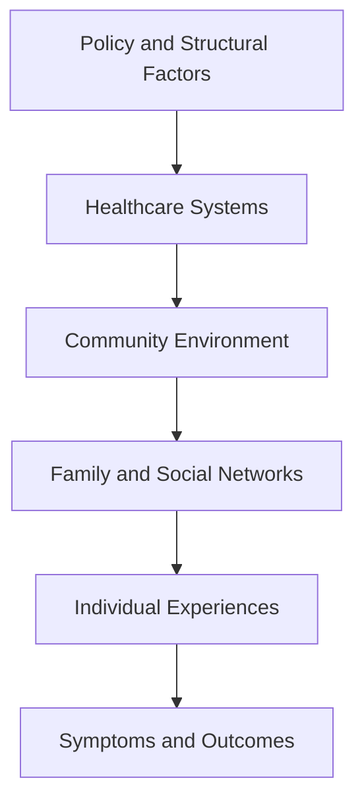

# Chapter 4: Thinking Like a Population Health Researcher

> *"Individuals experience disease. Populations experience patterns."*

## Why This Matters

In the previous chapter, we asked a deceptively simple question:

> Should you believe the result?

Suppose the answer is yes.

Suppose an observed association survives scrutiny. Confounding seems unlikely. Bias appears limited. The evidence is reasonably convincing.

A new question immediately emerges.

> Why does this pattern appear repeatedly across populations?

This is where population health begins.

Many investigators start by focusing on individuals. Why did this patient develop depression? Why did another recover? Why did one person respond to treatment while another did not?

These are important questions, and clinical medicine depends upon answering them.

Population health asks something different.

> Why do some groups experience different outcomes than others?

Why are depression rates higher in one community than another? Why do health disparities persist across generations? Why do some populations benefit from scientific advances more quickly than others?

The goal is not to replace individual explanations.

The goal is to recognize that individuals exist within larger systems, and those systems often shape health long before symptoms emerge.

---

## The Population Health Perspective

Imagine two psychiatrists.

The first sees a patient with depression and asks:

> Why is this patient depressed?

The second asks:

> Why are depression rates higher in this community than in another?

Both questions are valuable.

The first seeks an explanation for an individual outcome.

The second seeks an explanation for a population pattern.

Population health focuses on patterns. It asks why disease, wellness, risk, resilience, and recovery are distributed unevenly across groups of people. The answers often lie beyond any single individual. They emerge from interactions among biology, behavior, social environments, institutions, and public policy.

This broader perspective does not replace traditional epidemiology.

It expands it.

---

## What Experienced Population Health Researchers Do Differently

One of the defining differences between new investigators and experienced population health researchers is where they stop asking questions.

New investigators often identify a plausible explanation and stop.

Population health researchers keep going.

Consider a patient experiencing depression.

A reasonable explanation might involve poor sleep.

Why is sleep poor?

Perhaps the patient works overnight shifts.

Why are overnight shifts common?

Perhaps economic conditions limit employment opportunities.

Why do those economic conditions exist?

Perhaps transportation systems, educational opportunities, local industries, and public policy shape employment patterns.

Notice what happened.

The explanation moved steadily upstream.

Population health researchers develop the habit of repeatedly asking:

> What produced the conditions that produced the outcome?

This question often reveals influences that remain invisible when attention is focused exclusively on individuals.

The goal is not to identify a single root cause.

The goal is to understand how multiple levels of influence interact to shape health.

---

## Health Does Not Occur in Isolation

Medicine is often practiced one patient at a time.

Research frequently begins the same way.

A clinician notices a pattern. A patient experiences an unexpected outcome. A question emerges.

However, many health outcomes cannot be fully understood through individual-level explanations alone.

Consider depression.

Biology matters.

Psychology matters.

Life experiences matter.

But so do:

- Housing stability
- Educational opportunity
- Employment conditions
- Community safety
- Social support
- Healthcare access
- Public policy

Individuals do not exist in isolation.

They live within families, neighborhoods, schools, workplaces, healthcare systems, and societies. Those systems shape health, often long before symptoms emerge.

---

## A Worked Example: Following a Pattern Upstream

Suppose a county reports substantially higher depression rates than neighboring communities.

An individual-level explanation might focus on genetics, trauma exposure, coping strategies, substance use, or treatment access.

These factors matter.

A population health researcher asks additional questions.

Why are depression rates higher here?

Investigators notice that sleep disturbance is also unusually common.

Why?

Many residents work overnight or rotating shifts.

Why?

The local economy relies heavily on industries requiring shift work.

Why do workers remain in these jobs?

Alternative employment opportunities are limited.

Why?

Educational opportunities and transportation infrastructure create barriers to economic mobility.

Why?

Historical investment patterns, zoning decisions, economic policy, and broader structural factors helped shape the current environment.

At each stage, the explanation becomes broader.

The original outcome—depression—still occurs at the individual level.

Yet many of the forces influencing risk operate far beyond the individual.

This example illustrates one of the most important insights in population health:

Many health outcomes are simultaneously biological, psychological, social, economic, and political.

Understanding one level does not eliminate the need to understand the others.

---

## The Layers of Influence

Health outcomes rarely result from a single cause.

Instead, they emerge from multiple interacting influences operating simultaneously.

One useful way to think about these influences is as nested layers.



Each layer influences the layers beneath it.

An individual's health may be shaped by genetics, family relationships, neighborhood conditions, educational opportunities, healthcare access, economic resources, and public policy.

No single level provides a complete explanation.

Understanding health requires considering how these layers interact.

---

## Social Determinants of Health

One of the most influential concepts in modern population health is the social determinants of health.

These are the conditions in which people are born, grow, live, work, and age.

Examples include:

- Education
- Income
- Housing
- Employment
- Food security
- Transportation
- Healthcare access
- Exposure to discrimination

These factors influence health long before disease develops.

A child who grows up in a stable environment with access to education, nutrition, and healthcare enters adulthood with different opportunities than a child who lacks those resources.

The effects may accumulate across years or decades.

Importantly, social determinants are not simply background characteristics.

They are active drivers of health.

---

## A Psychiatric Example

Consider suicide risk.

Many individual-level factors are important.

- Psychiatric diagnoses
- Prior suicide attempts
- Substance use
- Family history

However, population-level influences also matter.

- Economic instability
- Access to mental healthcare
- Availability of crisis services
- Community connectedness
- Social isolation
- Public policy

Imagine two communities with similar rates of psychiatric illness.

One has robust mental health services, strong social support networks, and effective crisis intervention systems.

The other does not.

Different outcomes may emerge despite similar individual-level risk profiles.

This is population health thinking.

The question is not simply:

> Why did this person experience a crisis?

The question becomes:

> Why are crisis rates different across populations?

---

## A Life-Course Perspective

Population health encourages investigators to think across time.

Many adult outcomes reflect exposures that occurred years or decades earlier.

Examples include:

- Childhood adversity
- Environmental exposures
- Educational opportunities
- Family resources
- Early healthcare access

These experiences accumulate.

Their effects may remain invisible for years before eventually becoming apparent.

A life-course perspective reminds us that health outcomes often have long histories.

What appears to be an adult problem may have roots much earlier in life.

---

## Fundamental Cause Theory

One of the most influential ideas in population health is fundamental cause theory.

The theory proposes that access to resources influences health through multiple pathways simultaneously.

Examples of resources include:

- Knowledge
- Money
- Social connections
- Political influence
- Healthcare access

These resources help people avoid risks and benefit from new opportunities.

Importantly, the specific diseases may change over time.

The underlying pattern often remains.

This helps explain why health disparities frequently persist despite scientific advances.

---

## Health Disparities

Health disparities are differences in outcomes observed across groups.

These differences may occur across:

- Race and ethnicity
- Geography
- Socioeconomic status
- Disability status
- Healthcare access

Describing disparities is important.

Understanding why they exist is even more important.

Population health seeks to identify the mechanisms producing those differences and the systems that sustain them.

---

## Health Equity

Health equity refers to the principle that all individuals should have a fair opportunity to achieve their full health potential.

Equity is not synonymous with equality.

Equality implies identical treatment.

Equity recognizes that different populations face different barriers and may therefore require different resources or approaches.

Understanding this distinction is essential when interpreting population-level research and designing interventions.

---

## Healthcare Systems as Exposures

Researchers often treat healthcare systems as background infrastructure.

Population health encourages a different perspective.

Healthcare systems can function as exposures in their own right.

Consider:

- Insurance coverage
- Workforce availability
- Distance to care
- Wait times
- Continuity of care
- Quality of services

Healthcare systems do not merely respond to health patterns.

They help create them.

---

## The Population Health Imagination

One of the most valuable skills an investigator can develop is the ability to think beyond the variables immediately available in a dataset.

Researchers often observe only fragments of a much larger system.

A database may contain diagnoses, medications, laboratory values, and demographic variables. It may not contain neighborhood conditions, educational opportunities, historical context, social networks, policy environments, or structural barriers.

Yet these factors may still influence the outcomes being studied.

The population health imagination is the habit of asking:

> What larger forces might be shaping the patterns I observe?

Importantly, this does not mean inventing explanations unsupported by evidence.

It means recognizing that datasets rarely capture every relevant influence.

Good population health researchers learn to think beyond what is immediately measurable while remaining disciplined about what the data can actually support.

This balance—imagination combined with scientific restraint—is one of the defining features of mature population health thinking.

---

## Historical Lessons

Many of the greatest improvements in health resulted from population-level interventions rather than individual treatments.

Examples include:

- Clean water systems
- Vaccination programs
- Tobacco control policies
- Workplace safety regulations
- Motor vehicle safety standards

These interventions improved outcomes across entire populations.

Their success reminds us that health can often be improved by changing systems and environments rather than focusing exclusively on individual behavior.

---

## Why Population Health Matters for Psychiatry

Psychiatry is uniquely suited to population health thinking.

Mental health outcomes are influenced by biology, psychology, family environments, social networks, economic conditions, healthcare systems, and public policy.

No single level provides a complete explanation.

Population health provides a framework for understanding how these influences interact.

---

## Figure: Thinking Upstream

```mermaid
flowchart LR

A[Depressive Symptoms]
<-- B[Family and Social Context]

B <-- C[Community Environment]

C <-- D[Healthcare Access]

D <-- E[Economic Conditions]

E <-- F[Policy and Structural Factors]
```

Population health researchers continually ask:

> What lies further upstream?

---

## Reading Assignment

### Foundational Reading

[Placeholder for future reading assignment]

### Applied Example

[Placeholder for future reading assignment]

---

## Building Your Project

### Step 1

Identify your outcome of interest.

### Step 2

List individual-level influences.

### Step 3

List family-level influences.

### Step 4

List community-level influences.

### Step 5

List healthcare-system influences.

### Step 6

List policy-level influences.

### Step 7

Identify which factors are measured and which remain unmeasured.

---

## Investigator's Notebook

Answer the following:

- What upstream factors may influence my outcome?
- Which determinants are represented in my dataset?
- Which determinants are missing?
- How might those missing factors influence interpretation?
- What population-level interventions could alter outcomes?
- What larger systems might be shaping the patterns I observe?

---

## Questions Worth Carrying Forward

1. Why do health outcomes differ across populations?
2. What upstream factors shape downstream risk?
3. Which determinants are visible in my data?
4. Which determinants remain hidden?
5. What systems may be influencing the patterns I observe?

The next chapter asks a different question.

If population health research helps us understand patterns across groups of people, what responsibilities accompany that knowledge?

Why should society trust researchers with data, participants, and scientific authority in the first place?
