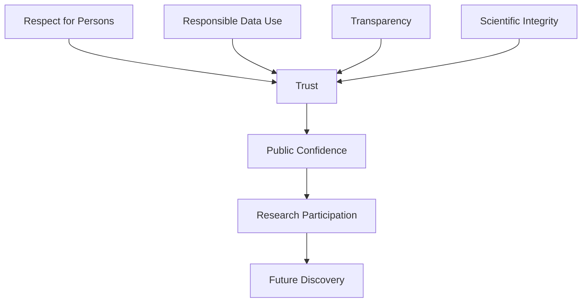

# Chapter 5: Research, Responsibility, and Trust

> *"Research is possible only because society permits it."*

## Why This Matters

In the previous chapter, we explored how population health researchers learn to think beyond individuals and consider the larger systems shaping health outcomes.

This broader perspective creates a new challenge.

As investigators gain the ability to study populations, access large datasets, influence public conversations, and shape policy decisions, they also acquire responsibilities.

Questions matter.

Measurement decisions matter.

Interpretations matter.

The ways findings are communicated matter.

Research is not conducted in isolation from society.

It depends upon trust.

Many trainees encounter research ethics through required trainings, online modules, institutional paperwork, and regulatory checklists. These activities are important, but they can unintentionally create the impression that ethics is primarily about compliance.

It is not.

At its core, research ethics is about trust.

Participants trust researchers. Communities trust institutions. Patients trust clinicians. Funders trust investigators. Society trusts scientists.

Without that trust, research becomes impossible.

The purpose of this chapter is not to review regulations.

The purpose is to explore the responsibilities that accompany scientific inquiry.

---

## The Social Contract of Research

Research is a privilege.

Investigators are granted access to information, resources, participants, biological samples, and public support because society believes scientific inquiry can improve health and well-being.

This arrangement can be understood as a social contract.

Researchers receive opportunities.

In return, they accept responsibilities.

These responsibilities include:

- Conducting studies honestly
- Protecting participants
- Reporting findings accurately
- Using resources responsibly
- Contributing knowledge that benefits others

Scientific integrity is therefore not merely a professional expectation.

It is part of the foundation that allows research to exist in the first place.

Most participants never meet the investigators who analyze their data. Many contribute information without receiving direct benefits themselves. Research depends upon the belief that investigators will act responsibly.

Maintaining that belief is one of the central obligations of every scientist.

---

## What Experienced Investigators Do Differently

New investigators often think about ethics at specific moments.

An IRB application.

A consent document.

A required training module.

A data-use agreement.

Experienced investigators tend to think differently.

They view ethics as a design principle rather than a regulatory hurdle.

Ethical considerations influence:

- Which questions are asked
- How participants are represented
- How variables are defined
- How uncertainty is communicated
- How findings are interpreted
- How conclusions are shared

Notice how closely these responsibilities mirror the themes of the previous chapters.

Chapter 1 focused on questions.

Chapter 2 focused on measurement.

Chapter 3 focused on interpretation.

Chapter 4 focused on populations.

Each of those decisions carries ethical consequences.

Ethics is not a separate stage of research.

It is woven throughout the entire process.

---

## Why Trust Matters

Trust is easy to lose and difficult to rebuild.

Participants may only contribute information if they believe it will be handled responsibly. Communities may support research only if they believe investigators are acting in good faith. The public may trust scientific findings only if researchers demonstrate transparency and integrity.

When trust erodes, participation declines.

Skepticism increases.

Scientific progress becomes more difficult.

A failure of trust in one area can influence perceptions of science more broadly.

For this reason, maintaining trust is not simply an ethical obligation.

It is essential infrastructure for research itself.

---

## Learning From Historical Failures

Many of the ethical principles guiding modern research emerged because previous investigators failed to protect participants.

Historical failures remind us that scientific advancement does not justify harmful practices.

Modern protections did not emerge accidentally.

They emerged because previous generations learned difficult lessons.

Understanding this history helps explain why oversight, transparency, informed consent, and participant protections remain essential.

The lesson is not that researchers should fear conducting studies.

The lesson is that scientific goals never eliminate ethical responsibilities.

---

## Respect for Persons

One of the foundational principles of research ethics is respect for persons.

Individuals should be treated as autonomous decision-makers whenever possible.

Participation should be voluntary.

Information should be communicated clearly.

People should understand what participation involves and how their information will be used.

Respect extends beyond informed consent documents.

It influences recruitment, communication, data handling, dissemination, and collaboration.

Researchers sometimes speak about datasets as though they are collections of variables.

It is important to remember that every row in a dataset represents a person.

Respect begins with recognizing that reality.

---

## Beneficence

Beneficence refers to the obligation to maximize potential benefits while minimizing potential harms.

No study is completely risk free.

Researchers must therefore think carefully about potential consequences.

These may include:

- Physical risks
- Psychological risks
- Social risks
- Privacy risks
- Group-level risks

The goal is not to eliminate all risk.

The goal is to ensure that risks are justified, minimized, and managed responsibly.

---

## Justice

Justice concerns the fair distribution of research burdens and benefits.

Historically, some populations have borne disproportionate research risks while receiving limited benefits from resulting discoveries.

Researchers should therefore ask:

Who is included?

Who is excluded?

Who benefits from the findings?

Who bears the burden of participation?

Justice requires more than equal treatment.

It requires thoughtful consideration of how research affects different populations.

---

## Representation Matters

Many datasets do not represent all populations equally.

This reality has scientific implications.

It also has ethical implications.

Researchers should evaluate whether certain groups are:

- Underrepresented
- Overrepresented
- Missing entirely

The goal is not perfect representation in every study.

The goal is recognizing who is present, who is absent, and how those patterns may influence interpretation.

Representation influences both validity and fairness.

---

## A Worked Example: A Suicide Risk Prediction Study

Imagine a research team developing a suicide risk prediction model using electronic health records.

The technical aspects of the project may seem straightforward.

A large dataset is available.

Predictive models can be trained.

Performance metrics can be calculated.

However, ethical questions immediately emerge.

Who is represented in the dataset?

Which populations may be underrepresented?

Could the model perform differently across demographic groups?

How should predictions be communicated to clinicians?

Could patients be stigmatized by risk classifications?

How should privacy be protected?

What happens if the model is wrong?

Notice that none of these questions involve statistical performance alone.

The model may be accurate.

The project may still raise important ethical concerns.

Responsible investigators think about these issues from the beginning rather than waiting until a study is complete.

---

## Responsible Use of Existing Data

Modern researchers increasingly work with data they did not collect themselves.

Electronic health records.

Biobanks.

Claims databases.

National registries.

Large-scale surveys.

These resources create extraordinary opportunities.

They also create new responsibilities.

Researchers may never meet the individuals whose information they analyze. It can therefore become easy to view data as abstract objects rather than information derived from real people.

Yet every diagnosis, survey response, laboratory value, and genetic variant ultimately originates from an individual who trusted a healthcare system, research institution, or public organization with personal information.

The fact that data are already available does not eliminate ethical obligations.

Questions worth asking include:

- Is this use consistent with participant expectations?
- Could findings unintentionally stigmatize a population?
- How should uncertainty be communicated?
- How can privacy risks be minimized?
- How should results be shared responsibly?

The growth of large-scale data resources makes these questions increasingly important.

---

## Stewardship of Data

Stewardship means recognizing that access to data carries responsibility.

Good stewardship involves:

- Protecting confidentiality
- Respecting privacy
- Maintaining security
- Limiting unnecessary access
- Using information responsibly

Researchers should aspire not merely to comply with rules but to earn trust.

Stewardship reflects professional responsibility rather than administrative obligation.

---

## Reproducibility and Transparency

Trust depends upon the ability of others to understand and evaluate scientific work.

Researchers should strive to communicate:

- What was done
- Why it was done
- How it was done
- What limitations exist

Transparent methods allow others to evaluate findings critically.

Reproducible analyses help strengthen confidence in results.

Transparency does not require perfection.

It requires honesty.

Scientific credibility often depends less on whether limitations exist and more on whether investigators acknowledge them openly.

---

## Authorship and Collaboration

Research is often a collaborative endeavor.

Strong collaborations require:

- Communication
- Transparency
- Accountability
- Respect

Many authorship conflicts arise not from malicious intent but from unclear expectations.

Discussing roles early can prevent misunderstandings later.

Research careers are built not only on publications but also on professional relationships.

---

## A Worked Example: When Overclaiming Erodes Trust

Imagine a study finds that individuals with sleep disturbance have higher rates of depression.

The observed association is statistically significant.

The investigators conclude:

> Sleep disturbance causes depression.

The problem is that the study was observational.

Alternative explanations remain possible.

Confounding may exist.

Reverse causation may exist.

Measurement limitations may exist.

The conclusion extends beyond the evidence.

The paper receives attention.

Clinicians cite it.

Journalists report it.

Eventually, later studies reveal a more complicated picture.

Trust suffers.

Not because the study was conducted poorly, but because the interpretation exceeded what the evidence could support.

Scientific trust is strengthened when investigators communicate carefully and weakened when certainty exceeds evidence.

---

## Responsible Uncertainty

Scientists sometimes worry that acknowledging uncertainty will weaken their work.

The opposite is often true.

Research rarely provides absolute certainty.

Most studies contribute pieces of evidence.

Responsible investigators communicate what is known, what remains uncertain, and what additional evidence would strengthen confidence.

Acknowledging uncertainty is not a sign of weakness.

It is a sign of scientific maturity.

---

## Scientific Integrity

Scientific integrity extends beyond avoiding misconduct.

It includes everyday decisions.

Examples include:

- Accurate reporting
- Honest communication
- Appropriate citation
- Reproducible analyses
- Constructive peer review
- Fair collaboration

Most scientists will never face dramatic ethical dilemmas.

Far more often, integrity is demonstrated through ordinary choices made repeatedly throughout a career.

---

## Figure: Building and Maintaining Trust

Trust is not a single event.

It is a system that must be continually maintained.

---

## Reading Assignment

### Foundational Reading

[Placeholder for future reading assignment]

### Applied Example

[Placeholder for future reading assignment]

---

## Building Your Project

### Step 1

Identify potential risks.

### Step 2

Consider who benefits from the study.

### Step 3

Evaluate representation.

### Step 4

Consider privacy and confidentiality.

### Step 5

Develop a plan for transparent communication.

### Step 6

Reflect on how trust influences the project.

---

## Investigator's Notebook

Answer the following:

- Why should participants trust this research?
- What responsibilities accompany access to these data?
- Who benefits from this project?
- Who might be overlooked?
- How will findings be communicated responsibly?
- What uncertainties should be acknowledged openly?

---

## Questions Worth Carrying Forward

1. Why should society trust researchers?
2. How do I protect that trust?
3. Who benefits from my work?
4. Who may be excluded?
5. Am I communicating findings responsibly?

The final chapter asks what happens after a study is completed.

How do questions become knowledge, knowledge become action, and action become impact?
