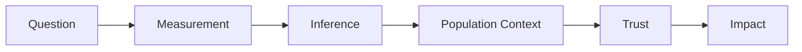
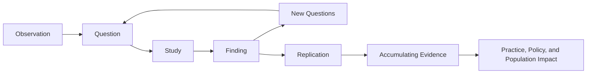

# Chapter 6: From Question to Impact

> *"Research does not end when the analysis is complete. Research ends when knowledge changes how people think, practice, or act."*

## Why This Matters

This handbook began with a question.

Not a statistical test.

Not a dataset.

Not a manuscript.

A question.

Throughout the preceding chapters, we have followed that question through each stage of the research process. We considered how questions emerge, how concepts become variables, how associations are interpreted, how populations shape health, and why society trusts researchers with scientific authority.

The final step is understanding impact.

Many trainees assume that completing an analysis represents the end of a research project.

In reality, it is often the beginning.

A result sitting on a hard drive has little impact. A manuscript that is never read changes nothing. A presentation that fails to communicate its message creates little value.

Research matters because it contributes to a larger scientific conversation.

The purpose of research is not merely to generate results.

The purpose is to generate understanding.

---

## The Handbook in One Framework

Every chapter in this guide describes a different stage of the same process.

Chapter 1 asked:

> What should I study?

Chapter 2 asked:

> What am I actually measuring?

Chapter 3 asked:

> Should I believe the result?

Chapter 4 asked:

> Why does the pattern exist across populations?

Chapter 5 asked:

> Why should society trust this work?

This chapter asks:

> What happens next?

Understanding this progression helps place individual projects within a larger scientific journey.

---

## Research as a Conversation

One of the most helpful ways to think about science is as an ongoing conversation.

Scientific progress rarely occurs through a single study.

Instead, knowledge advances through countless contributions made by investigators across years, decades, and sometimes generations.

Each study contributes a small piece of evidence.

Future studies evaluate, refine, challenge, replicate, or expand upon those findings.

Viewed in isolation, individual projects often appear modest.

Viewed collectively, they become part of something much larger.

Many early-career investigators feel pressure to produce definitive answers.

Most projects will not do that.

Nor should they.

A good study often answers one question while generating several new ones.

That is how science progresses.

---

## What Experienced Investigators Do Differently

New investigators often optimize for projects.

Experienced investigators often optimize for questions.

The distinction matters.

Projects have deadlines.

Questions have lifetimes.

A project may result in a manuscript, presentation, thesis chapter, or conference abstract.

A question may generate an entire research program.

Experienced investigators learn that individual studies are rarely the ultimate goal.

Instead, studies become tools for exploring enduring uncertainty.

This mindset changes how research is approached.

Failures become informative.

Unexpected findings become opportunities.

New questions become successes rather than distractions.

The investigator gradually shifts from asking:

> How do I complete this project?

to asking:

> What am I trying to understand?

That shift often marks the beginning of a mature research career.

---

## The Life of a Research Finding

Imagine a study discovers that sleep disturbance predicts future depression risk.

The finding is interesting.

But what happens next?

Other investigators attempt replication.

Researchers explore biological mechanisms.

Clinicians consider implications for patient care.

Intervention studies evaluate whether improving sleep alters outcomes.

Guidelines may eventually incorporate new evidence.

Public health programs may emerge.

Over time, evidence accumulates.

Eventually, the original finding becomes part of a much larger body of knowledge.

The impact of a study is rarely determined at the moment it is published.

Impact emerges gradually as findings interact with other evidence.

Research is therefore less like delivering a verdict and more like contributing testimony to an ongoing discussion.

---

## A Worked Example: From Observation to Impact

Consider the observation that many patients with depression report poor sleep.

An investigator develops a research question:

> Does sleep disturbance predict future depression risk?

A study is conducted.

An association is identified.

The story does not end there.

Other groups attempt replication.

Additional studies investigate whether sleep disturbance precedes depressive symptoms.

Researchers explore biological pathways involving circadian regulation, stress physiology, and emotional processing.

Intervention studies test whether improving sleep reduces depression risk.

Meta-analyses synthesize evidence.

Clinical recommendations evolve.

Years later, sleep assessment becomes a routine component of mental health care.

No single study created this change.

Impact emerged because many studies contributed evidence to the same conversation.

The most influential studies are rarely influential because they provide final answers.

They are influential because they move important conversations forward.

---

## Telling a Scientific Story

The most successful papers do more than report results.

They tell a story.

This does not mean exaggerating findings or creating artificial narratives.

Rather, it means helping readers understand:

- Why the study was performed
- What uncertainty motivated the work
- How the question was investigated
- What was learned
- Why the findings matter

Readers remember questions.

They rarely remember isolated statistics.

A compelling scientific story helps connect evidence back to the uncertainty that inspired the work.

---

## Writing Clearly

Clear writing reflects clear thinking.

Many trainees assume that scientific writing should sound complicated.

The opposite is usually true.

Strong scientific writing is:

- Precise
- Concise
- Transparent
- Logical

One useful editing exercise involves asking:

> Could a colleague summarize my main finding after reading this section once?

If the answer is no, additional clarity may be needed.

Scientific writing is communication.

Communication succeeds only when understanding occurs.

---

## Tables and Figures

Many readers examine tables and figures before reading the full manuscript.

For this reason, visual presentation deserves careful attention.

Effective tables and figures should:

- Communicate a clear message
- Be interpretable independently
- Avoid unnecessary complexity
- Highlight key findings

Every figure should answer a question.

Every table should provide useful information.

The goal is not to maximize the number of visuals.

The goal is to maximize understanding.

---

## Presenting Research

Presentations require different skills than manuscripts.

Readers can revisit a paragraph.

Audiences cannot rewind a live presentation.

As a result, simplicity becomes even more important.

One useful principle is:

> One major idea per slide.

The purpose of a presentation is not to communicate everything.

The purpose is to communicate what matters most.

---

## Peer Review

Peer review can be intimidating.

Critical feedback may feel personal.

It is not.

Peer review is part of the scientific process.

Reviewers identify:

- Limitations
- Alternative interpretations
- Missing context
- Opportunities for improvement

Not every comment will be correct.

Not every recommendation should be implemented.

However, thoughtful engagement with feedback almost always improves the final product.

---

## Translation

Research becomes impactful when findings extend beyond the original study.

Translation may occur through:

- Clinical practice
- Public health interventions
- Educational efforts
- Policy decisions
- Future research

Most projects will not immediately change practice.

That is normal.

Translation often occurs gradually as evidence accumulates.

Understanding this process helps investigators maintain realistic expectations about impact.

---

## Population Impact

Some of the most influential advances in health emerged from population-level interventions rather than individual treatments.

Examples include:

- Vaccination programs
- Tobacco control policies
- Motor vehicle safety regulations
- Environmental protections
- Clean water systems

These successes remind us that research can influence entire populations.

Sometimes small changes distributed across large populations generate extraordinary benefits.

Population health researchers therefore think not only about statistical significance but also about practical significance.

Who benefits?

How many people benefit?

What barriers prevent implementation?

These questions help connect evidence to action.

---

## Building a Research Program

One of the most important themes in this handbook is the distinction between projects and questions.

A single project can be valuable.

A research program is often more impactful.

Research programs emerge when investigators pursue related questions over time.

Consider the question:

> How does sleep influence psychiatric outcomes?

Potential projects include:

- Sleep and depression
- Sleep and anxiety
- Sleep and cognition
- Sleep and suicide risk
- Sleep and neurodevelopment

The individual projects differ.

The underlying question remains.

Strong careers are frequently built around enduring questions rather than isolated studies.

Projects come and go.

Questions endure.

---

## Building a Scientific Identity

Many trainees worry about selecting the perfect topic.

In reality, scientific identities often develop gradually.

Researchers rarely begin their careers with fully formed programs of inquiry.

Instead, interests evolve through projects, collaborations, observations, mentorship, failures, unexpected findings, and opportunities.

Over time, patterns emerge.

Certain questions repeatedly capture attention.

Certain themes reappear across projects.

Eventually, a scientific identity begins to form.

Importantly, scientific identities are often built retrospectively.

Investigators rarely start by declaring:

> This will be my life's work.

Instead, they repeatedly return to the same questions.

Years later, those questions become recognizable as a research program.

The most successful investigators are often recognized not for studying a single topic, but for pursuing a coherent set of questions over time.

---

## What Success Actually Looks Like

Many trainees define success narrowly.

Publication.

Funding.

Awards.

Academic positions.

These achievements matter.

However, they represent only part of the picture.

Research can be successful when it:

- Improves understanding
- Influences practice
- Generates new questions
- Trains future investigators
- Benefits patients or communities

Some of the most meaningful contributions are difficult to quantify.

Impact often appears in unexpected forms.

A study may influence how clinicians think.

An idea may inspire future work.

A mentor may shape future investigators.

The most important contributions are not always the easiest to measure.

---

## Figure: The Scientific Conversation Cycle

Scientific progress is rarely linear.

Research advances through repeated cycles of questioning, investigation, and refinement.

---

## Reading Assignment

### Foundational Reading

[Placeholder for future reading assignment]

### Applied Example

[Placeholder for future reading assignment]

---

## Building Your Project

### Step 1

Write your research question in one sentence.

### Step 2

Describe why the answer matters.

### Step 3

Identify the primary audience.

### Step 4

Describe potential implications.

### Step 5

Identify the next logical study.

### Step 6

Consider how the project fits into a larger research program.

---

## Investigator's Notebook

Answer the following:

- Why does this project matter?
- Who benefits from the findings?
- What conversation am I contributing to?
- What impact do I hope the work will have?
- What question should come next?
- How does this project fit into a broader research program?

---

## Questions Worth Carrying Forward

1. Why does this work matter?
2. Who benefits from the findings?
3. What should happen next?
4. How does this project fit into a broader research program?
5. What impact do I hope to create?

This concludes the core chapters of the PERT Field Guide.

The appendices that follow provide practical reference materials, decision tools, and resources intended to support future projects.

Wherever your career leads, remember that meaningful research rarely begins with a dataset, a statistical test, or a manuscript.

It begins with a question.

And the most important questions are often the ones that continue to matter long after a project is finished.
