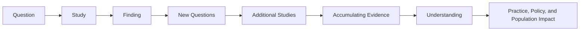

# Chapter 6: From Question to Impact

> *"Research does not end when a study is completed. Research endures when a question continues to matter."*

## Why This Matters

When many people imagine a research project, they imagine a finished product.

A manuscript is published. A poster is presented. A thesis is defended. An analysis is completed. The project reaches its endpoint and the work is considered finished.

Research careers rarely feel that way from the inside.

As investigators gain experience, they often discover that individual projects become less important than the questions connecting them. Studies begin and end. Datasets change. Methods evolve. New technologies emerge. Yet certain uncertainties remain stubbornly persistent, drawing researchers back again and again.

A trainee may begin by studying sleep and depression. Years later, they may find themselves investigating sleep and anxiety, sleep and cognition, sleep and neurodevelopment, or sleep and neurodegenerative disease. The projects differ. The methods differ. The populations differ.

The underlying question remains.

This shift in perspective often marks an important transition in scientific development. Early in training, research can feel project-centered. The focus is naturally directed toward completing analyses, preparing presentations, and meeting deadlines. These goals are important. Projects are how scientific work becomes tangible.

Over time, however, many investigators begin to realize that projects are not the destination.

They are vehicles.

The deeper goal is understanding.

Every chapter in this handbook has explored a different aspect of that process. We began by asking how meaningful research questions emerge. We discussed how concepts become variables, how findings are interpreted, how populations shape health, and why society trusts researchers with the responsibility of conducting scientific inquiry.

This final chapter focuses on what happens after the study itself.

How does a question become a research program?

How does a finding become part of scientific knowledge?

How does knowledge eventually influence practice, policy, and the lives of real people?

Perhaps most importantly, what does it mean to build a career around questions that matter?

## Research as a Conversation

One of the most helpful ways to think about science is as a conversation that spans generations.

When students first enter research, it is easy to imagine that studies exist independently. A project begins, data are collected, analyses are performed, and conclusions are reported. The study appears self-contained.

In reality, every project enters a conversation that began long before the investigators arrived.

Questions emerge because earlier studies left uncertainties unresolved. New findings are interpreted within the context of existing evidence. Future researchers build upon, refine, challenge, or occasionally overturn what came before.

Seen from this perspective, scientific papers resemble contributions to an ongoing discussion rather than final declarations of truth.

This can be surprisingly liberating.

Many early-career investigators feel pressure to produce definitive answers. They worry that a project has failed if the results are inconclusive, unexpected, or difficult to interpret. Yet some of the most productive studies in science are valuable precisely because they reveal uncertainty that had previously gone unrecognized.

Good research often answers one question while creating several new ones.

That is not a weakness of the scientific process.

It is how the scientific process moves forward.

A manuscript may represent the conclusion of a project, but it is often the beginning of a conversation.

## Projects and Questions

One of the most important differences between early-career and experienced investigators has little to do with statistics, study design, or technical expertise.

It often comes down to where they focus their attention.

New investigators naturally think in terms of projects. A project has a beginning and an end. There is a dataset to analyze, a manuscript to write, a presentation to prepare, or a deadline to meet. Success is often defined by completion. The project is finished, the deliverable is submitted, and attention shifts to the next task.

This mindset is entirely reasonable. Research careers are built from projects, and every investigator spends time navigating them.

Over time, however, many researchers begin to organize their thinking differently.

Instead of focusing primarily on projects, they become increasingly interested in questions.

The distinction may sound subtle, but it can fundamentally change the way a career develops.

Consider an investigator interested in psychiatric outcomes associated with sleep disturbance. One project might examine depression. Another might focus on anxiety. A third might explore cognition, substance use, suicidality, or neurodevelopmental conditions. Each study asks a slightly different question and uses different methods, populations, or datasets.

Yet beneath the individual projects lies a broader uncertainty:

> How does sleep influence mental health?

The projects are temporary.

The question endures.

Researchers who build influential careers often return repeatedly to the same uncertainties, approaching them from different angles over many years. New datasets become available. Technologies improve. Methods evolve. The underlying question remains compelling.

In retrospect, many successful research programs appear remarkably coherent. Looking forward, however, they rarely felt that way. Most investigators do not begin their careers with a carefully designed twenty-year plan. They follow their curiosity. Certain questions repeatedly capture their attention. Patterns emerge only after years of work.

A research program is often less something that is chosen than something that gradually reveals itself.

## Most Research Changes Nothing

At first glance, this heading may sound discouraging.

In reality, it reflects one of the most reassuring truths in science.

Students are often exposed to research through landmark discoveries. They learn about studies that transformed medicine, reshaped policy, or fundamentally changed scientific understanding. Because these examples are memorable, they can unintentionally create the impression that impactful research always produces immediate and visible change.

Most scientific work does not operate that way.

Imagine a single observational study reporting an association between sleep disturbance and depression. The study may be carefully designed and scientifically valuable. Yet it is unlikely to alter clinical practice overnight. Physicians do not immediately rewrite treatment guidelines. Public health agencies do not instantly redesign programs. Healthcare systems rarely change because of a single publication.

Instead, the study enters the literature.

Months later, another group conducts a related investigation. A different team explores biological mechanisms. Researchers attempt replication in other populations. Systematic reviews begin synthesizing evidence. Gradually, a larger picture starts to emerge.

Only after years of accumulated work does a genuine shift in understanding occur.

This process can feel slow, but it is one of the reasons science is generally trustworthy. Major changes in knowledge rarely depend on a single study. They emerge because many independent lines of evidence converge on similar conclusions.

Understanding this reality can be liberating for trainees.

The purpose of your first project is not to change the world.

The purpose is to contribute honestly to a body of evidence that may eventually help change the world.

When viewed through this lens, impact becomes a collective achievement rather than an individual accomplishment.

## How Knowledge Accumulates

Scientific progress is often portrayed as a series of breakthroughs.

Occasionally, breakthroughs do occur. More often, however, progress resembles the gradual construction of a mosaic. Individual pieces may appear modest when viewed alone. Their significance becomes clearer only when they are considered together.

This cumulative nature of science explains why replication is so important. A finding that appears once may be interesting. A finding that appears repeatedly across populations, methodologies, and research groups becomes increasingly difficult to dismiss.

The process also explains why disagreement is not necessarily a problem. Conflicting findings often reveal hidden complexities, measurement challenges, population differences, or assumptions that deserve closer examination. What appears to be contradiction may ultimately lead to a deeper understanding of the phenomenon under study.

Experienced investigators learn to think less about individual studies and more about bodies of evidence. They ask questions such as:

* What does the literature look like as a whole?
* Which findings have been replicated?
* Where do uncertainties remain?
* What explanations best account for the available evidence?

These questions move beyond the results of any single project and focus instead on how knowledge develops over time.

Scientific impact rarely emerges from isolated discoveries.

It emerges from the gradual accumulation of evidence, interpretation, debate, refinement, and replication.

The most influential studies are often influential not because they provide final answers, but because they move that process forward.

## When a Paper Becomes a Turning Point

Most scientific papers enter the literature quietly.

They are published, read by a relatively small number of specialists, cited occasionally, and gradually incorporated into a larger body of evidence. Even excellent studies often follow this path. They make valuable contributions without fundamentally altering the direction of a field.

Occasionally, however, a study changes the kinds of questions researchers believe are worth asking.

At the time, the shift may be difficult to recognize. The paper appears alongside countless others. Reviewers evaluate it. Editors make decisions. Researchers read it and discuss it. Nothing seems dramatically different.

Years later, its influence becomes unmistakable.

Entire research programs emerge.

New methods are developed.

Questions that once seemed speculative become central to a field.

The significance of the paper is revealed not by the findings alone, but by everything that follows.

This is one of the reasons scientific impact can be so difficult to predict. Investigators often imagine that influential research provides definitive answers. In reality, some of the most influential studies become important because they reveal new uncertainties, create new possibilities, or encourage researchers to think differently about an existing problem.

The true impact of a paper is often measured not by the conclusions it reaches, but by the conversations it starts.

## Reading Assignment

### A Study That Changed the Questions

**International Schizophrenia Consortium. (2009).** *Common Polygenic Variation Contributes to Risk of Schizophrenia and Bipolar Disorder.*

📄 **Read the paper:** [ISC (2009) Polygenic Risk Study](../papers/ISC_2009_PRS_Paper.pdf)

As you read, try to place yourself in the position of a researcher encountering this paper when it was first published.

Rather than focusing exclusively on the technical details, consider the broader scientific context. What question were the investigators attempting to answer? Why was that question important at the time? How did the study challenge existing assumptions about the genetic architecture of psychiatric disorders?

Most importantly, think about what happened after publication.

Today, polygenic risk scores are widely discussed within psychiatric genetics, cardiovascular disease, oncology, neurodegenerative disease, and many other fields. Large biobanks routinely generate genome-wide data. Researchers study genetic liability across populations numbering in the hundreds of thousands or even millions.

None of that future was fully visible in 2009.

Yet this paper helped establish a foundation upon which much of that later work was built.

### Reflection Questions

1. What scientific question motivated this study?

2. Why was the question difficult to answer using the data and methods available at the time?

3. What assumptions about psychiatric genetics were being challenged or reconsidered?

4. Which findings in the paper do you think seemed most important when it was first published?

5. Looking back from the present day, which aspects of the paper appear most influential?

6. Did the study provide a final answer, or did it create new questions?

7. How does the paper illustrate the difference between completing a project and contributing to a long-term scientific conversation?

### Why This Paper Matters

This chapter has emphasized that impactful research is rarely defined by immediate outcomes. Scientific influence often emerges gradually as findings are replicated, extended, challenged, and incorporated into future work.

The ISC paper provides a powerful example of this process.

The study did not create modern psychiatric genetics on its own. It did not resolve every question about genetic liability, schizophrenia, or bipolar disorder. What it did accomplish was equally important. It helped shift the conversation.

Researchers began asking new questions.

New datasets were assembled.

New methods were developed.

New collaborations emerged.

Years later, the influence of the original question can still be seen across psychiatric genomics, biobank research, and precision medicine.

The lesson extends far beyond genetics.

The most influential studies are often those that help a field see a problem differently.

## Helping Other People Understand

If science is a conversation, communication is one of the mechanisms through which that conversation occurs.

This may seem obvious, yet communication is sometimes treated as something that happens after the science is complete. A study is conducted, analyses are finished, and then the findings are written up for publication or presentation.

Experienced investigators tend to view communication differently.

Communication is part of the science.

A brilliant analysis that cannot be understood has limited value. A thoughtful study that fails to explain why the question matters may struggle to find an audience. Important findings that are communicated poorly may never influence the conversations they deserve to influence.

For this reason, writing, figures, presentations, and discussion sections should not be viewed as administrative tasks attached to a project. They are opportunities to help other people understand what was learned and why it matters.

The goal is not persuasion.

The goal is clarity.

Strong scientific communication helps readers understand the question, evaluate the evidence, and appreciate the significance of the findings without overstating what the study can support.

The best papers rarely succeed because they contain the most complex analyses.

They succeed because they help readers think clearly about an important problem.

## Writing as a Form of Thinking

Many trainees assume that writing occurs after thinking.

In practice, writing is often how thinking becomes clearer.

Few investigators produce a perfect interpretation during the first analysis. More often, understanding develops gradually through the process of explaining the work to others. Questions emerge. Assumptions become visible. Weaknesses reveal themselves. Connections that were previously unnoticed begin to appear.

Writing therefore serves two purposes simultaneously.

It communicates ideas to other people.

It helps investigators refine those ideas for themselves.

This is one reason clear scientific writing is so valuable. Clarity in writing often reflects clarity in thought. When a result is difficult to explain, the challenge may not be purely linguistic. Sometimes the underlying interpretation requires additional refinement.

Strong scientific writing does not attempt to sound impressive.

It attempts to be understood.

The same principle applies to tables, figures, posters, and presentations. Their purpose is not to demonstrate how much work was performed. Their purpose is to help an audience understand the most important ideas emerging from that work.

```
```
## Peer Review and the Scientific Community

At some point, every researcher discovers that scientific work does not belong entirely to the person who conducted it.

A manuscript is submitted and reviewed by strangers. A conference presentation generates questions that had not previously occurred to the presenter. Collaborators challenge interpretations. Reviewers point out weaknesses, missing context, or alternative explanations. Sometimes the feedback is insightful. Sometimes it is frustrating. Occasionally it is both.

For trainees, these experiences can feel deeply personal. After all, research projects often require months or years of effort. Criticism of the work can feel uncomfortably close to criticism of the investigator.

With experience, many researchers begin to view the process differently.

The purpose of peer review is not to determine whether an investigator is intelligent, capable, or deserving of success. The purpose is to improve the quality of scientific knowledge. Reviewers identify weaknesses because weaknesses matter. Colleagues ask difficult questions because important questions deserve scrutiny. Scientific claims become stronger when they survive serious attempts to challenge them.

This perspective connects directly to many of the ideas discussed earlier in the handbook. Chapter 3 emphasized the importance of considering alternative explanations. Chapter 5 explored the relationship between scientific integrity and public trust. Peer review is one of the mechanisms through which those principles are translated into practice.

Science advances because ideas are evaluated collectively rather than accepted individually.

At first, students participate in this process primarily as recipients of feedback. Eventually, they become contributors themselves. They review abstracts, critique manuscripts, mentor trainees, and help shape the development of future work. In doing so, they become part of the same scientific community that once guided their own growth.

## Building a Research Program

Research careers are often described through a series of projects.

A thesis.

A fellowship.

A publication.

A grant.

A clinical trial.

These milestones are real and important, but they can sometimes obscure a larger pattern.

Most influential investigators are not remembered because they completed a particular project. They are remembered because they spent years pursuing a question that mattered to them.

The path rarely appears obvious while it is unfolding.

A researcher may begin by studying one aspect of a problem and gradually become interested in related questions. New technologies create opportunities that did not previously exist. Collaborations introduce different perspectives. Unexpected findings redirect attention toward entirely new areas of inquiry.

Looking back, the collection of projects often appears coherent. Looking forward, the path was usually much less predictable.

A research program emerges when individual studies begin connecting to one another through a shared intellectual purpose. The projects may differ substantially in methodology, population, or scope, but they are united by a common effort to understand something important.

For this reason, it is often more useful to ask:

> What am I trying to understand?

than:

> What project am I working on?

Projects have timelines.

Questions have lifetimes.

## Building a Scientific Identity

Many trainees worry about choosing the perfect niche.

They imagine that successful investigators identify a specialty early in their careers and then spend decades following a carefully planned trajectory.

Most scientific careers are far messier than that.

Scientific identities tend to emerge gradually through repeated acts of curiosity. Certain problems continue attracting attention. Certain questions remain interesting long after others have faded. Patterns begin to appear across projects, collaborations, and publications.

Over time, colleagues start recognizing those patterns as well.

Some investigators become known for studying a particular disorder. Others become associated with a methodological approach, a theoretical framework, or a persistent scientific question. What unites these paths is not that they were planned perfectly from the beginning, but that they developed through sustained engagement with ideas that continued to matter.

This process cannot be rushed.

Nor should it be.

A scientific identity is not something that is declared.

It is something that emerges.

## What Success Actually Looks Like

Academic environments often provide a narrow definition of success.

Publications.

Grant funding.

Awards.

Promotions.

Leadership positions.

These achievements matter. They create opportunities and allow researchers to continue pursuing important questions. Yet they are not the only forms of success, nor are they necessarily the most meaningful.

Some studies improve understanding even when they never change clinical practice.

Some projects generate questions that become more influential than the original findings.

Some investigators have their greatest impact through mentorship, collaboration, or the development of tools that enable the work of others.

Scientific influence often travels through pathways that are difficult to measure. A conversation changes how a colleague thinks about a problem. A lecture inspires a student to pursue a particular field. A paper introduces a new way of framing a question. Years later, the consequences become visible in ways that nobody could have anticipated.

For this reason, many experienced investigators eventually begin evaluating success differently.

Not:

> How much did I produce?

But:

> What did I contribute?

That shift may be one of the most important transitions in a research career.



*Figure 6.1. Scientific impact rarely emerges from a single study. Questions generate studies, studies generate findings, findings generate new questions, and evidence accumulates over time. Over years or decades, this process can influence understanding, clinical practice, public policy, and population health.*

## Building Your Project

As you finish this handbook, return one final time to the question you have been developing.

Why does this question matter?

Who would benefit from a better answer?

What uncertainty are you trying to reduce?

How might your study contribute to the broader conversation surrounding the topic?

If the project succeeds, what question should come next?

Perhaps most importantly, ask yourself whether the underlying question would still interest you after the current project is finished.

Research careers are often shaped by the questions that continue demanding attention long after individual studies have ended.

## Investigator's Notebook

### Reflection 1

What question has remained most interesting to you throughout this handbook?

Why does it continue to capture your attention?

### Reflection 2

Who do you hope will benefit from the work you conduct?

### Reflection 3

Think about a researcher whose career you admire.

What questions have they spent years trying to answer?

### Reflection 4

How would you define success if publications, grants, and academic titles were removed from the equation?

### Reflection 5

What kind of investigator do you hope to become?

## Questions Worth Carrying Forward

This handbook began with a question.

Not a dataset.

Not a statistical test.

Not a manuscript.

A question.

Everything that followed emerged from that starting point. We explored how questions become studies, how concepts become variables, how evidence is interpreted, how health patterns emerge across populations, and why scientific work depends upon public trust. Along the way, we encountered uncertainty, complexity, competing explanations, ethical responsibilities, and the realities of communicating scientific knowledge.

The details will change throughout your career.

New datasets will emerge. Methods will evolve. Technologies that seem extraordinary today will eventually become routine. Entire fields may transform in ways that are difficult to imagine from the present moment.

What will remain is the need for thoughtful people willing to ask meaningful questions and pursue them honestly.

If there is one lesson worth carrying forward, it is that science is not a collection of answers. It is a process for engaging with uncertainty. The most important questions are rarely resolved completely. Instead, each generation contributes a little more understanding than the one before it.

You do not need to have all the answers.

No investigator ever does.

Your responsibility is to ask good questions, follow evidence wherever it leads, remain humble when uncertainty persists, and contribute what you can to a conversation that began long before you arrived and will continue long after you are gone.

That conversation is one of humanity's most ambitious attempts to understand itself and the world around it.

Every study adds a sentence.

Every investigator contributes a voice.

The next question is yours.

